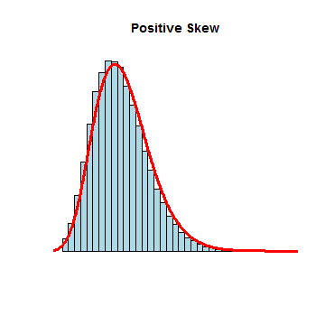
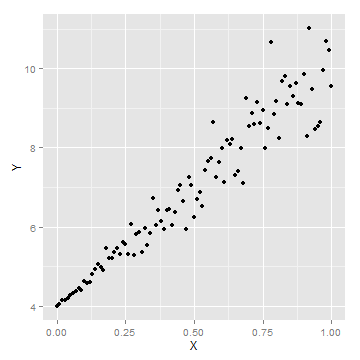
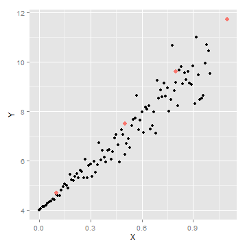
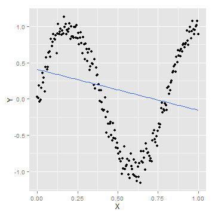
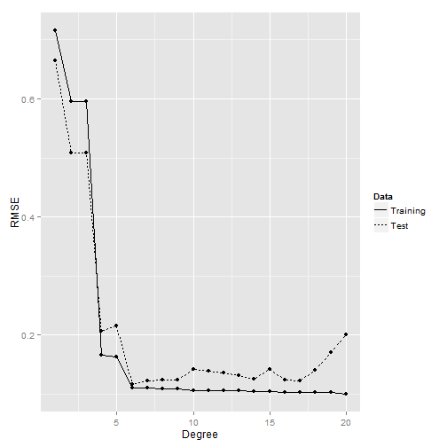

---

title       : Machine Learning with R
author      : Ilan Man
job         : Strategy Operations  @ Squarespace
framework   : io2012        # {io2012, html5slides, shower, dzslides, ...}
highlighter : highlight.js  # {highlight.js, prettify, highlight}
hitheme     : tomorrow      # 
widgets     : mathjax       # {mathjax, quiz, bootstrap}
mode        : selfcontained # {standalone, draft}

----

## Agenda 
<space>

1. Machine Learning Overview
2. Exploring Data
3. Nearest Neighbors
4. Naive Bayes
5. Measuring Performance
6. Linear Regression

----

## Machine Learning Overview
# What is it?  
<space>

- Field of study interested in transforming data into intelligent actions
- Intersection of statistics, available data and computing power
- It is NOT data mining
- Data mining is an exploratory exercise, whereas most machine learning has a known answer
- Data mining is a subset of machine learning (unsupervised)

----

## Machine Learning Overview
# Uses
<space>

- Predict outcome of elections
- Email filtering - spam or not
- Credit fraud prediction
- Image processing
- Customer churn
- Customer subscription rates

----

## Machine Learning Overview
# How do machines learn?
<space>

- Data input 
  - Provides a factual basis for reasoning
- Abstraction 
- Generalization 

----

## Machine Learning Overview
# Abstraction
<space>

- Assign meaning to the data
- Formulas, graphs, logic, etc...
- Your model
- Fitting model is called training

----

## Machine Learning Overview
# Generalization
<space>

- Turn abstracted knowledge into something that can be utilized
- Model user heuristics since it cannot see every example
  - When hueristics are systematically wrong, the algorithm has a bias
- Very simple models have high bias
  - Some bias is good - let's us ignore the noise

----

## Machine Learning Overview
# Generalization
<space>

- After training, the model is tested on unseen data
- Perfect generalization is exceedingly rare
  - Partly due to noise
  - Measurement error
  - Change in user behavior
  - Incorrect data, erroneous values, etc...
- Fitting too closesly to the noise leads to overfitting
  - Complex models have high variance
  - Good on training, bad on testing

----

## Machine Learning Overview
# Steps to apply Machine Learning
<space>

1. Collect data
2. Explore and preprocess data 
  - Majority of the time is spent in this stage
3. Train the model
  - Specific tasks will inform which algorithm is appropriate
4. Evaluate model performance
  - Performance measures depend on use case
5. Improve model performance as necessary

----

## Machine Learning Overview
# Choosing an algorithm
<space>

- Consider input data
- An <strong>example</strong> is one data point that the machine is intended to learn 
- A feature is a characteristic of the example
  - e.g. Number of times the word "viagra" appears in an email
- For classification problems, a label is the example's classification
- Most algorithms require data in matrix format because Math said so
- Features can be numeric, categorical/nominal or ordinal

----

## Machine Learning Overview
# Types of algorithms
<space>

- Supervised
  - Discover relationship between known, target feature and other features
  - Predictive
  - Classification and numeric prediction tasks
- Unsupervised
  - Unkown answer
  - Descriptive
  - Pattern discovery and clustering into groups
  - Requires human intervention to interpret clusters

----

## Machine Learning Overview
# Summary
<space>

1. Generalization and Abstraction
2. Overfitting vs underfitting
3. The right algorithm will be informed by the problem to be solved
4. Terminology

----

## Exploring Data
# Exploring and understanding data
<space>

- Load and explore the data


```r
data(iris)

# inspect the structure of the dataset
str(iris)
```

```
## 'data.frame':	150 obs. of  5 variables:
##  $ Sepal.Length: num  5.1 4.9 4.7 4.6 5 5.4 4.6 5 4.4 4.9 ...
##  $ Sepal.Width : num  3.5 3 3.2 3.1 3.6 3.9 3.4 3.4 2.9 3.1 ...
##  $ Petal.Length: num  1.4 1.4 1.3 1.5 1.4 1.7 1.4 1.5 1.4 1.5 ...
##  $ Petal.Width : num  0.2 0.2 0.2 0.2 0.2 0.4 0.3 0.2 0.2 0.1 ...
##  $ Species     : Factor w/ 3 levels "setosa","versicolor",..: 1 1 1 1 1 1 1 1 1 1 ...
```

----

## Exploring Data
# Exploring and understanding data
<space>


```r
# summarize the data  - five number summary
summary(iris[,1:4])
```

```
##   Sepal.Length   Sepal.Width    Petal.Length   Petal.Width 
##  Min.   :4.30   Min.   :2.00   Min.   :1.00   Min.   :0.1  
##  1st Qu.:5.10   1st Qu.:2.80   1st Qu.:1.60   1st Qu.:0.3  
##  Median :5.80   Median :3.00   Median :4.35   Median :1.3  
##  Mean   :5.84   Mean   :3.06   Mean   :3.76   Mean   :1.2  
##  3rd Qu.:6.40   3rd Qu.:3.30   3rd Qu.:5.10   3rd Qu.:1.8  
##  Max.   :7.90   Max.   :4.40   Max.   :6.90   Max.   :2.5
```

----

## Exploring Data
# Exploring and understanding data
<space>

- Measures of central tendency: mean and median
  - Mean is sensitive to outliers
    - Trimmed mean
  - Median is resistant

 

----

## Exploring Data
# Exploring and understanding data
<space>

- Measures of dispersion
  - Range is the `max()` - `min()`
  - Interquartile range (IQR) is the `Q3` - `Q1`
  - Quantile


```r
quantile(iris$Sepal.Length, probs = c(0.10,0.50,0.99))
```

```
10% 50% 99% 
4.8 5.8 7.7 
```

----

## Exploring Data
# Visualizing - Boxplots
<space>

- Lets you see the spread in the data


----

## Exploring Data
# Visualizing - histograms
<space>

- Each bar is a 'bin'
- Height of bar is the frequency (count of) that bin
- Some distributions are normally distributed (bell shaped) or skewed (heavy tails)


----

## Exploring Data
# Visualizing - scatterplots
<space>

- Useful for visualizing bivariate relationships (2 variables)


```
## Error: could not find function "ggplot"
```

----

## Exploring Data
# Summary
<space>

- Measures of central tendency and dispersion
- Visualizing data using histograms, boxplots, scatterplots
- Skewed vs normally distributed data

----

## K-Nearest Neighbors
# Classification using kNN
<space>

- Understanding the algorithm
- Data Preparation
- Case study: diagnosing breast cancer
- Summary

----

## K-Nearest Neighbors
# The Concept
<space>

- Things that are similar are probably of the same class
- Good for: when it's difficult to define, but "you know it when you see it"
- Bad for: when a clear distinction doesn't exist

----

## K-Nearest Neighbors
# The Algorithm
<space>


```
## Warning: package 'plyr' was built under R version 3.0.2
```

```
## Error: could not find function "ggplot"
```

----

## K-Nearest Neighbors
# The Algorithm
<space>


```
## Error: could not find function "ggplot"
```

```
## function (x, y, ...) 
## UseMethod("plot")
## <bytecode: 0x7ff9423da2d8>
## <environment: namespace:graphics>
```

----

## K-Nearest Neighbors
# The Algorithm
<space>


```
## Error: could not find function "geom_point"
```

- Suppose we had a new point with Sepal Length of 7 and Petal Length of 4
- Which species will it probably belong to?

----

## K-Nearest Neighbors
# The Algorithm
<space>

- Calculate its nearest neighbor
  - Euclidean distance
  - $dist(p,q) = \sqrt{(p_1-q_1)^2+(p_2-q_2)^2+ ... + (p_n-q_n)^2}$
  - Closest neighbor -> 1-NN
  - 3 closest neighbors -> 3-NN. 
  - Winner is the majority class of all neighbors

----

## K-Nearest Neighbors
# The Algorithm
<space>

- Calculate its nearest neighbor
  - Euclidean distance
  - $dist(p,q) = \sqrt{(p_1-q_1)^2+(p_2-q_2)^2+ ... + (p_n-q_n)^2}$
  - Closest neighbor -> 1-NN
  - 3 closest neighbors -> 3-NN. 
  - Winner is the majority class of all neighbors
- Why not just fit to all data points?

----

## K-Nearest neighbors
# Bias vs. Variance
<space>

- Fitting to every point results in an overfit model
  - High variance problem
- Fitting to only 1 point results in an underfit model
  - High bias problem
- Choosing the right $k$ is a balance between bias and variance
- Rule of thumb: $k = \sqrt{N}$

----

## K-Nearest neighbors
# Data preparation
<space>

- Classify houses based on prices and square footage


```r
library(scales)  # format ggplot() axis
```

```
## Warning: package 'scales' was built under R version 3.0.2
```

```r
price <- seq(300000,600000,by=10000)
size <- price/1000 + rnorm(length(price),10,50)
houses <- data.frame(price,size)
ex <- ggplot(houses,aes(price,size))+geom_point()+scale_x_continuous(labels = comma)+
  xlab("Price")+ylab("Size")+ggtitle("Square footage vs Price")
```

```
## Error: could not find function "ggplot"
```

----

## K-Nearest neighbors
# Data Preparation
<space>


```
## Error: object 'ex' not found
```

----

## K-Nearest neighbors
# Data Preparation
<space>


```
## Error: object 'ex' not found
```

```
## Error: object 'center_plot' not found
```

----

## K-Nearest neighbors
# Data Preparation
<space>


```
## Error: object 'center_plot' not found
```

```
## Error: object 'new_plot' not found
```

----

## K-Nearest neighbors
# Data Preparation
<space>


```r
# 1) using loops
loop_dist <- 0
for(i in 1:nrow(houses)){
  loop_dist[i] <- sqrt(sum((new_p-houses[i,])^2))
  }

# 2) vectorized
vec_dist <- sqrt(rowSums(t(new_p-t(houses))^2))
closest <- data.frame(houses[which.min(vec_dist),])
print(closest)
```

```
   price  size
11 4e+05 441.8
```

----

## K-Nearest Neighbors
# Data Preparation
<space>


```
## Error: object 'new_plot' not found
```

----

## K-Nearest Neighbors
# Data Preparation
<space>


```
## Error: object 'new_plot' not found
```

----

## K-Nearest Neighbors
# Data Preparation
<space>

- Feature scaling. Two common approaches:
- min-max normalization
  - $X_{new} = \frac{X-min(X)}{max(X) - min(X)}$
- z-score standardization
  - $X_{new} = \frac{X-mean(X)}{sd(X)}$
- Euclidean distance doesn't discriminate between important and noisy features
  - can add weights

----

## K-Nearest Neighbors
# Data Preparation
<space>


```r
new_house <- scale(houses)
new_new <- c((new[1]-mean(houses[,1]))/sd(houses[,1]),(new[2]-mean(houses[,2]))/sd(houses[,2]))
```

```
Error: object of type 'closure' is not subsettable
```

```r
vec_dist <- sqrt(rowSums(t(new_new-t(new_house))^2))
```

```
Error: object 'new_new' not found
```

```r
which.min(vec_dist)
```

```
[1] 11
```

----

## K-Nearest Neighbors
# Data Preparation
<space>


```
## Error: object 'new_plot' not found
```

----

## K-Nearest Neighbors
# Lazy learner
<space>

- kNN doesn't actually learn anything!
- Stores training data and applies it - verbatim - to new examples
- Known as instance-based learning
- Non-parametric learning method
- Harder for us to understand how the classifier is using the data
- However kNN finds natural patterns 
- Don't need to fit aribtrarily to a model

----

## K-Nearest Neighbors
# Case study
<space>


```r
data <- read.table('http://archive.ics.uci.edu/ml/machine-learning-databases/breast-cancer-wisconsin/wdbc.data', sep=',', stringsAsFactors=FALSE, header=FALSE)

# first column has the ID which is not useful
data <- data[,-1]
# names taken from the .names file online
n <- c("radius","texture","perimeter","area","smoothness","compactness",
   "concavity","concave_points","symmetry","fractal")
ind <- c("mean","std","worst")

headers<-as.character()
for(i in ind){
  headers<-c(headers,paste(n,i))
  }
names(data)<-c("diagnosis",headers)
```

----

## K-Nearest Neighbors
# Case study
<space>


```r
str(data[,1:10])
```

```
'data.frame':	569 obs. of  10 variables:
 $ diagnosis          : chr  "M" "M" "M" "M" ...
 $ radius mean        : num  18 20.6 19.7 11.4 20.3 ...
 $ texture mean       : num  10.4 17.8 21.2 20.4 14.3 ...
 $ perimeter mean     : num  122.8 132.9 130 77.6 135.1 ...
 $ area mean          : num  1001 1326 1203 386 1297 ...
 $ smoothness mean    : num  0.1184 0.0847 0.1096 0.1425 0.1003 ...
 $ compactness mean   : num  0.2776 0.0786 0.1599 0.2839 0.1328 ...
 $ concavity mean     : num  0.3001 0.0869 0.1974 0.2414 0.198 ...
 $ concave_points mean: num  0.1471 0.0702 0.1279 0.1052 0.1043 ...
 $ symmetry mean      : num  0.242 0.181 0.207 0.26 0.181 ...
```

----

## K-Nearest Neighbors
# Case study
<space>


```r
# inspect remaining data more closely
prop.table(table(data$diagnosis)); head(data)[2:6]
```

```

     B      M 
0.6274 0.3726 
```

```
  radius mean texture mean perimeter mean area mean smoothness mean
1       17.99        10.38         122.80    1001.0         0.11840
2       20.57        17.77         132.90    1326.0         0.08474
3       19.69        21.25         130.00    1203.0         0.10960
4       11.42        20.38          77.58     386.1         0.14250
5       20.29        14.34         135.10    1297.0         0.10030
6       12.45        15.70          82.57     477.1         0.12780
```

----

## K-Nearest Neighbors
# Case study
<space>


```r
# scale each numeric value
scaled_data <- as.data.frame(lapply(data[,-1], scale))
scaled_data <- cbind(diagnosis=data$diagnosis, scaled_data)
head(scaled_data[2:6])
```

```
  radius.mean texture.mean perimeter.mean area.mean smoothness.mean
1      1.0961      -2.0715         1.2688    0.9835          1.5671
2      1.8282      -0.3533         1.6845    1.9070         -0.8262
3      1.5785       0.4558         1.5651    1.5575          0.9414
4     -0.7682       0.2535        -0.5922   -0.7638          3.2807
5      1.7488      -1.1508         1.7750    1.8246          0.2801
6     -0.4760      -0.8346        -0.3868   -0.5052          2.2355
```

----

## K-Nearest Neighbors
# Case study
<space>


```r
library(class)  # get k-NN classifier
```

```
Warning: package 'class' was built under R version 3.0.2
```

```r
predict_1 <- knn(train = scaled_data[,2:31], test = scaled_data[,2:31],
                 cl = scaled_data[,1],
                 k = floor(sqrt(nrow(scaled_data))))                  
table(predict_1)
```

```
predict_1
  B   M 
378 191 
```

----

## K-Nearest Neighbors
# Case study
<space>


```r
pred_B <- which(predict_1=="B")
actual_B <- which(scaled_data[,1]=="B")
pred_M <- which(predict_1=="M")
actual_M <- which(scaled_data[,1]=="M")
true_positive <- sum(pred_B %in% actual_B)
true_negative <- sum(pred_M %in% actual_M)
false_positive <- sum(pred_B %in% actual_M)
false_negative <- sum(pred_M %in% actual_B)

conf_mat <- matrix(c(true_positive,false_positive,false_negative,true_negative),nrow=2,ncol=2)

acc <- sum(diag(conf_mat))/sum(conf_mat)
tpr <- conf_mat[1,1]/sum(conf_mat[1,])
tn <- conf_mat[2,2]/sum(conf_mat[2,])
```

----

## K-Nearest Neighbors
# Case study
<space>


```
   acc    tpr     tn 
0.9596 0.9972 0.8962 
```

```
    tp  fp
fn 356   1
tn  22 190
```

- Is that right?

----

## K-Nearest Neighbors
# Case study
<space>


```r
# create randomized training and testing sets
total_n <- nrow(scaled_data)

# train on 2/3 of the data
train_ind <- sample(total_n,total_n*2/3)
train_labels <- scaled_data[train_ind,1]
test_labels <- scaled_data[-train_ind,1]
train_set <- scaled_data[train_ind,2:31]
test_set <- scaled_data[-train_ind,2:31]
```

----

## K-Nearest Neighbors
# Case study
<space>


```r
library(class)
predict_1 <- knn(train = train_set, test = test_set, cl = train_labels,
                 k = floor(sqrt(nrow(train_set))))                  
table(predict_1)
```

```
predict_1
  B   M 
129  61 
```

----

## K-Nearest Neighbors
# Case study
<space>


```r
pred_B <- which(predict_1=="B")
test_B <- which(test_labels=="B")
pred_M <- which(predict_1=="M")
test_M <- which(test_labels=="M")
true_positive <- sum(pred_B %in% test_B)
true_negative <- sum(pred_M %in% test_M)
false_positive <- sum(pred_B %in% test_M)
false_negative <- sum(pred_M %in% test_B)

conf_mat <- matrix(c(true_positive,false_negative,false_positive,true_negative),nrow=2,ncol=2)

acc <- sum(diag(conf_mat))/sum(conf_mat)
tpr <- conf_mat[1,1]/sum(conf_mat[1,])
tn <- conf_mat[2,2]/sum(conf_mat[2,])
```

----

## K-Nearest Neighbors
# Case study
<space>


```
   acc    tpr     tn 
0.9526 0.9380 0.9836 
```

```
       Actual B Actual M
Pred B      121        8
Pred M        1       60
```

----

## K-Nearest Neighbors
# Case study
<space>


```r
library(caret)
```

```
Warning: package 'caret' was built under R version 3.0.2
```

```
Loading required package: lattice
```

```
Warning: package 'lattice' was built under R version 3.0.2
```

```
Loading required package: ggplot2
```

```
Warning: package 'ggplot2' was built under R version 3.0.2
```

```r
confusionMatrix(predict_1,test_labels)$table
```

```
Warning: package 'e1071' was built under R version 3.0.2
```

```
          Reference
Prediction   B   M
         B 121   8
         M   1  60
```

----

## K-Nearest Neighbors
# Case study
<space>

```
Exercise: Find the Accuracy for various value of k.
Hint 1 - look at the `knn` function parameters
```

----

## K-Nearest Neighbors
# Case study
<space>


```r
k_params <- c(1,3,5,10,15,20,25,30,40)
perf_acc <- NULL
per <- NULL
for(i in k_params){
  predictions <- knn(train = train_set,
                     test = test_set,
                     cl = train_labels,
                     k = i)
  conf <- confusionMatrix(predictions,test_labels)$table
  perf_acc <- sum(diag(conf))/sum(conf)
  per <- rbind(per,c(i, perf_acc,conf[[1]],conf[[3]],conf[[2]],conf[[4]]))
}
```

----

## K-Nearest Neighbors
# Case study
<space>


```
## Warning: package 'xtable' was built under R version 3.0.2
```

<!-- html table generated in R 3.0.1 by xtable 1.7-3 package -->
<!-- Sun Jul  6 21:54:12 2014 -->
<TABLE border=1>
<TR> <TH>  </TH> <TH> K </TH> <TH> Acc </TH> <TH> TP </TH> <TH> FP </TH> <TH> FN </TH> <TH> TN </TH>  </TR>
  <TR> <TD align="right"> 1 </TD> <TD align="right"> 1.00 </TD> <TD align="right"> 0.95 </TD> <TD align="right"> 119.00 </TD> <TD align="right"> 7.00 </TD> <TD align="right"> 3.00 </TD> <TD align="right"> 61.00 </TD> </TR>
  <TR> <TD align="right"> 2 </TD> <TD align="right"> 3.00 </TD> <TD align="right"> 0.96 </TD> <TD align="right"> 121.00 </TD> <TD align="right"> 6.00 </TD> <TD align="right"> 1.00 </TD> <TD align="right"> 62.00 </TD> </TR>
  <TR> <TD align="right"> 3 </TD> <TD align="right"> 5.00 </TD> <TD align="right"> 0.95 </TD> <TD align="right"> 120.00 </TD> <TD align="right"> 7.00 </TD> <TD align="right"> 2.00 </TD> <TD align="right"> 61.00 </TD> </TR>
  <TR> <TD align="right"> 4 </TD> <TD align="right"> 10.00 </TD> <TD align="right"> 0.96 </TD> <TD align="right"> 120.00 </TD> <TD align="right"> 5.00 </TD> <TD align="right"> 2.00 </TD> <TD align="right"> 63.00 </TD> </TR>
  <TR> <TD align="right"> 5 </TD> <TD align="right"> 15.00 </TD> <TD align="right"> 0.96 </TD> <TD align="right"> 121.00 </TD> <TD align="right"> 7.00 </TD> <TD align="right"> 1.00 </TD> <TD align="right"> 61.00 </TD> </TR>
  <TR> <TD align="right"> 6 </TD> <TD align="right"> 20.00 </TD> <TD align="right"> 0.95 </TD> <TD align="right"> 121.00 </TD> <TD align="right"> 8.00 </TD> <TD align="right"> 1.00 </TD> <TD align="right"> 60.00 </TD> </TR>
  <TR> <TD align="right"> 7 </TD> <TD align="right"> 25.00 </TD> <TD align="right"> 0.95 </TD> <TD align="right"> 121.00 </TD> <TD align="right"> 8.00 </TD> <TD align="right"> 1.00 </TD> <TD align="right"> 60.00 </TD> </TR>
  <TR> <TD align="right"> 8 </TD> <TD align="right"> 30.00 </TD> <TD align="right"> 0.96 </TD> <TD align="right"> 122.00 </TD> <TD align="right"> 7.00 </TD> <TD align="right"> 0.00 </TD> <TD align="right"> 61.00 </TD> </TR>
  <TR> <TD align="right"> 9 </TD> <TD align="right"> 40.00 </TD> <TD align="right"> 0.96 </TD> <TD align="right"> 122.00 </TD> <TD align="right"> 8.00 </TD> <TD align="right"> 0.00 </TD> <TD align="right"> 60.00 </TD> </TR>
   </TABLE>

----

## K-Nearest Neighbors
# Summary
<space>
  
- kNN is a lazy learning algorithm
- Assigns the majority class of the k data points closest to the new data
  - Ensure all features are on the same scale
- Pros
  - Can be applied to data from any distribution
  - Simple and intuitive
- Cons
  - Choosing k requires trial and error
  - Testing step is computationally expensive (unlike parametric models)
  - Needs a large number of training samples to be useful


----

## Naive Bayes
# Probabilistic learning 
<space>

- Probability and Bayes Theorem
- Understanding Naive Bayes
- Case study: filtering mobile phone spam

----

## Naive Bayes
# Probability and Bayes Theorem
<space>

- Terminology: 
  + `probability`
  + `event` 
  + `trial` - e.g. 1 flip of a coin, 1 toss of a die
- $X_{i}$ is an event
- The set of all events is $\{X_{1},X_{2},...,X_{n}\}$
- The probability of an event is the frequency of its occurrence
  + $0 \leq P(X) \leq 1$
  + $P(\sum_{i=1}^{n} X_{i}) = \sum_{i=1}^{n} P(X_{i})$

----

## Naive Bayes
# Probability and Bayes Theorem
<space>

- $A \cap B$ is "A and B"
- Independent events
  - $P(A \cap B) = P(A) \times P(B)$
- $A \mid B$ is "A given B"
- Conditional probability
  - $P(A \mid B) = \frac{P(A \cap B)}{P(B)}$

----

## Naive Bayes
# Probability and Bayes Theorem
<space>

- Independent events
  - $A \cap B$ is "A and B"
  - $P(A \cap B) = P(A) \times P(B)$
- Conditional probability
  - $A \mid B$ is "A given B"
  - $P(A \mid B) = \frac{P(A \cap B)}{P(B)}$ 
  - $P(B \mid A) = \frac{P(B \cap A)}{P(A)}$
  - $P(B \mid A) \times P(A) = P(B \cap A)$

----

## Naive Bayes
# Probability and Bayes Theorem
<space>

- Independent events
  - $A \cap B$ is "A and B"
  - $P(A \cap B) = P(A) \times P(B)$
- Conditional probability
  - $A \mid B$ is "A given B"
  - $P(A \mid B) = \frac{P(A \cap B)}{P(B)}$ 
  - $P(B \mid A) = \frac{P(B \cap A)}{P(A)}$
  - $P(B \mid A) \times P(A) = P(B \cap A)$
  - but... $P(B \cap A) = P(A \cap B)$
  
----

## Naive Bayes
# Probability and Bayes Theorem
<space>

- Independent events
  - $A \cap B$ is "A and B"
  - $P(A \cap B) = P(A) \times P(B)$
- Conditional probability
  - $A \mid B$ is "A given B"
  - $P(A \mid B) = \frac{P(A \cap B)}{P(B)}$ 
  - $P(B \mid A) = \frac{P(B \cap A)}{P(A)}$
  - $P(B \mid A) \times P(A) = P(B \cap A)$
  - but... $P(B \cap A) = P(A \cap B)$
  - so.... $P(A \mid B) = \frac{P(B \mid A) \times P(A)}{P(B)}$ <-- *Bayes Theorem!*

----

## Naive Bayes
# Bayes Example
<space>

- A decision should be made using all available information
  - As new information enters, the decision might be changed
- Example: Email filtering
  - spam and non-spam (AKA ham)
  - classify emails depending on what words they contain
  - $P(spam \mid CASH!)$ = ?

----

## Naive Bayes
# Bayes Example
<space>


```r
# data frame with frequency of emails with the word "cash"
bayes_ex <- data.frame(cash_yes=c(10,3,13),
                      cash_no=c(20,67,87),
                      total=c(30,70,100),
                      row.names=c('spam','ham','total'))
bayes_ex
```

```
      cash_yes cash_no total
spam        10      20    30
ham          3      67    70
total       13      87   100
```

----

## Naive Bayes
# Bayes Example
<space>

- Recall Bayes Theorem: 
  - $P(A \mid B) = \frac{P(B \mid A) \times P(A)}{P(B)}$
- A = event that email is spam  
- B = event that "CASH" exists in the email  
$P(spam \mid cash=yes) = P(cash=yes \mid spam) \times \frac{P(spam)}{P(cash=yes)}$

----

## Naive Bayes
# Bayes Example
<space>

- Recall Bayes Theorem: 
  - $P(A \mid B) = \frac{P(B \mid A) \times P(A)}{P(B)}$
- A = event that email is spam  
- B = event that "CASH" exists in the email  
$P(spam \mid cash=yes) = P(cash=yes \mid spam) \times \frac{P(spam)}{P(cash=yes)}$<br>
$P(cash = yes \mid spam) = \frac{10}{30}$<br>
$P(spam) =  \frac{30}{100}$<br>
$P(cash = yes) = \frac{13}{100}$<br>
 = $\frac{10}{30} \times \frac{\frac{30}{100}}{\frac{13}{100}} = 0.769$ 

----

## Naive Bayes
# Bayes Example
<space>

- Recall Bayes Theorem: 
  - $P(A \mid B) = \frac{P(B \mid A) \times P(A)}{P(B)}$
- A = event that email is spam  
- B = event that "CASH" exists in the email  
$P(spam \mid cash=yes) = P(cash=yes \mid spam) \times \frac{P(spam)}{P(cash=yes)}$<br>
$P(cash = yes \mid spam) = \frac{10}{30}$<br>
$P(spam) =  \frac{30}{100}$<br>
$P(cash = yes) = \frac{13}{100}$<br>
 = $\frac{10}{30} \times \frac{\frac{30}{100}}{\frac{13}{100}} = 0.769$ 

`Exercise:` $P(ham \mid cash = no)$ = ?


----

## Naive Bayes
# Why Naive?
<space>

- Assumes all features are independent and equally important
- NB still performs very well out of the box

```
      cash_yes cash_no furniture_yes furniture_no total
spam        10      20             6           24    30
ham          3      67            20           50    70
total       13      87            26           74   100
```

$P(spam \mid cash=yes \cap furniture=no) = \frac{P(cash=yes \cap furniture=no \mid spam) \times P(spam)}{P(cash=yes \cap furniture=no)}$

----

## Naive Bayes
# Why Naive?
<space>

- As features increase, formula becomes very expensive
- Solution: assume each feature is independent of any other feature, given they are in the same class 
  - Independence formula: $P(A \cap B) = P(A) \times P(B)$
  - Called "class conditional independence":<br>
  - $P(spam \mid cash=yes \cap furniture=no) =$ 

----

## Naive Bayes
# Why Naive?
<space>

- As features increase, formula becomes very expensive
- Solution: assume each feature is independent of any other feature, given they are in the same class 
  - Independence formula: $P(A \cap B) = P(A) \times P(B)$
  - Called "class conditional independence":<br>
  - $P(spam \mid cash=yes \cap furniture=no) =$ 
  - $\frac{P(cash=yes \mid spam) \times P(furniture=no \mid spam) \times P(spam)}{P(cash=yes) \times P(furniture=no)}$

----

## Naive Bayes
# Why Naive?
<space>

- As features increase, formula becomes very expensive
- Solution: assume each feature is independent of any other feature, given they are in the same class 
  - Independence formula: $P(A \cap B) = P(A) \times P(B)$
  - Called "class conditional independence":<br>
  - $P(spam \mid cash=yes \cap furniture=no) =$ 
  - $\frac{P(cash=yes \mid spam) \times P(furniture=no \mid spam) \times P(spam)}{P(cash=yes) \times P(furniture=no)} =$
  - $\frac{\frac{10}{30} \times \frac{24}{30}}{\frac{13}{100} \times \frac{74}{100}}$

----

## Naive Bayes
# Why Naive?
<space>

- As features increase, formula becomes very expensive
- Solution: assume each feature is independent of any other feature, given they are in the same class 
  - Independence formula: $P(A \cap B) = P(A) \times P(B)$
  - Called "class conditional independence":<br>
  - $P(spam \mid cash=yes \cap furniture=no) = \frac{P(cash=yes \mid spam) \times P(furniture=no \mid spam) \times P(spam)}{P(cash=yes) \times P(furniture=no)}$
  = $\frac{\frac{10}{30} \times \frac{24}{30} \times \frac{30}{100}}{\frac{13}{100} \times \frac{74}{100}}$

`Exercise`: $P(ham \mid cash=yes \cap furniture=no) = ?$

----

## Naive Bayes
# The Laplace Estimator
<space>


```
      cash_yes cash_no furniture_yes furniture_no party_yes party_no total
spam        10      20             6           24         3       27    30
ham          3      67            20           50         0       70    70
total       13      87            26           74         3       97   100
```

$P(ham \mid cash=yes \cap party=yes) = \frac{P(cash=yes \mid ham) \times P(party=yes \mid ham) \times P(ham)}{P(cash=yes) \times P(party=yes)} = ?$

----

## Naive Bayes
# The Laplace Estimator
<space>


```
      cash_yes cash_no furniture_yes furniture_no party_yes party_no total
spam        10      20             6           24         3       27    30
ham          3      67            20           50         0       70    70
total       13      87            26           74         3       97   100
```

$P(ham \mid cash=yes \cap party=yes) = \frac{P(cash=yes \mid ham) \times P(party=yes \mid ham) \times P(ham)}{P(cash=yes) \times P(party=yes)} = ?$
$\frac{\frac{3}{70} \times \frac{0}{70} \times \frac{70}{100}}{\frac{13}{100} \times \frac{3}{100}} = 0$

- if party appears in an email, there's no chance it could be ham...really??

----

## Naive Bayes
# The Laplace Estimator
<space>

$P(ham \mid cash=yes \cap party=yes) =$
$\frac{P(cash=yes \mid ham) \times P(party=yes \mid ham) \times P(ham)}{P(cash=yes) \times P(party=yes)} =$
$\frac{\frac{3}{70} \times \frac{0}{70} \times \frac{70}{100}}{\frac{13}{100} \times \frac{3}{100}} = 0$

- if party appears in an email, there's no chance it could be ham...really??
- To get around 0's, apply Laplace estimator
  - add 1 to every feature
  
----

## Naive Bayes
# Case Study: SMS spam filtering
<space>


```r
sms_data  <- read.table('SMSSpamCollection.txt',stringsAsFactors=FALSE,sep='\t',quote="", col.names=c("type","text"))
```

```
Warning: cannot open file 'SMSSpamCollection.txt': No such file or
directory
```

```
Error: cannot open the connection
```

```r
str(sms_data)
```

```
Error: object 'sms_data' not found
```

```r
sms_data$type <- factor(sms_data$type)
```

```
Error: object 'sms_data' not found
```

----

## Naive Bayes
# Case Study: SMS spam filtering
<space>

- Remove words like `and`, `the`, `or`

```r
library(tm)
```

```
Warning: package 'tm' was built under R version 3.0.2
```

```r
# create collection of text documents, a corpus
sms_corpus <- Corpus(VectorSource(sms_data$text))
```

```
Error: object 'sms_data' not found
```

```r
sms_corpus
```

```
Error: object 'sms_corpus' not found
```

----

## Naive Bayes
# Case Study: SMS spam filtering
<space>


```r
# look at first few text messages
for (i in 1:5){
  print(sms_corpus[[i]])
}
```

```
Error: object 'sms_corpus' not found
```

----

## Naive Bayes
# Case Study: SMS spam filtering
<space>


```r
# clean the data using helpful functions
corpus_clean <- tm_map(sms_corpus,tolower)
```

```
## Error: object 'sms_corpus' not found
```

```r
corpus_clean <- tm_map(corpus_clean, removeWords, stopwords())
```

```
## Error: object 'corpus_clean' not found
```

```r
corpus_clean <- tm_map(corpus_clean, removePunctuation)
```

```
## Error: object 'corpus_clean' not found
```

```r
corpus_clean <- tm_map(corpus_clean, stripWhitespace)
```

```
## Error: object 'corpus_clean' not found
```

```r
# now make each word in the corpus into it's own token
# each row is a message and each column is a word. Cells are frequency counts.
sms_dtm <- DocumentTermMatrix(corpus_clean)
```

```
## Error: object 'corpus_clean' not found
```

----

## Naive Bayes
# Case Study: SMS spam filtering
<space>


```r
# create training and testing set
total_n <- nrow(sms_data)
```

```
## Error: object 'sms_data' not found
```

```r
train_ind <- sample(total_n,total_n*2/3)
dtm_train_set <- sms_dtm[train_ind,]
```

```
## Error: object 'sms_dtm' not found
```

```r
dtm_test_set <- sms_dtm[-train_ind,]
```

```
## Error: object 'sms_dtm' not found
```

```r
corpus_train_set <- corpus_clean[train_ind]
```

```
## Error: object 'corpus_clean' not found
```

```r
corpus_test_set <- corpus_clean[-train_ind]
```

```
## Error: object 'corpus_clean' not found
```

```r
raw_train_set <- sms_data[train_ind,1:2]
```

```
## Error: object 'sms_data' not found
```

```r
raw_test_set <- sms_data[-train_ind,1:2]
```

```
## Error: object 'sms_data' not found
```

```r
# remove infrequent terms - not useful for classification
freq_terms <- c(findFreqTerms(dtm_train_set,7))
```

```
## Error: object 'dtm_train_set' not found
```

```r
corpus_train_set <- DocumentTermMatrix(corpus_train_set, list(dictionary = freq_terms))
```

```
## Error: object 'corpus_train_set' not found
```

```r
corpus_test_set <- DocumentTermMatrix(corpus_test_set, list(dictionary = freq_terms))
```

```
## Error: object 'corpus_test_set' not found
```

----

## Naive Bayes
# Case Study: SMS spam filtering
<space>


```r
# convert frequency counts to "yes" or "no"
# implicitly weighing each term the same
convert <- function(x) {
  x <- ifelse(x > 0, 1, 0)
  x <- factor(x, levels = c(0,1), labels=c('No','Yes'))
  return(x)
}

corpus_train_set <- apply(corpus_train_set, MARGIN = 2 , FUN = convert)
```

```
## Error: object 'corpus_train_set' not found
```

```r
corpus_test_set <- apply(corpus_test_set, MARGIN = 2 , FUN = convert)
```

```
## Error: object 'corpus_test_set' not found
```

----

## Naive Bayes
# Case Study: SMS spam filtering
<space>


```r
# use naiveBayes() function from e1071 package
library(e1071)

naive_model <- naiveBayes(x = corpus_train_set, y = raw_train_set$type)
```

```
Error: object 'corpus_train_set' not found
```

```r
predict_naive <- predict(naive_model, corpus_test_set)
```

```
Error: object 'naive_model' not found
```

```r
naive_conf <- confusionMatrix(predict_naive,raw_test_set$type)$table
```

```
Error: object 'predict_naive' not found
```

```r
naive_conf
```

```
Error: object 'naive_conf' not found
```

----

## Naive Bayes
# Case Study: SMS spam filtering
<space>


```r
# use naiveBayes() function from e1071 package
library(e1071)

naive_model <- naiveBayes(x = corpus_train_set, y = raw_train_set$type)
```

```
Error: object 'corpus_train_set' not found
```

```r
predict_naive <- predict(naive_model, corpus_test_set)
```

```
Error: object 'naive_model' not found
```

```r
naive_conf <- confusionMatrix(predict_naive,raw_test_set$type)$table
```

```
Error: object 'predict_naive' not found
```

```r
naive_conf
```

```
Error: object 'naive_conf' not found
```

```
Exercise:
1) Calculate the true positive and false positive rate.  
2) Calculate the error rate (hint: error rate = 1 - accuracy)  
3) Set the Laplace = 1 and rerun the model and confustion matrix. Does this improve the model?
```

----

## Naive Bayes
# Summary
<space>

- Probabalistic approach
- Naive Bayes assumes features are independent, conditioned on being in the same class
- Useful for text classification
- Strengths
  - simple, fast
  - Does well with noisy and missing data
  - Doesn't need large training set
- Weaknesses
  - Assumes all features are independent and equally important
  - Not well suited for numeric data sets


----

## Model Performance
# Measuring performance
<space>

- Classification
- Regression (more on this later)

----

## Model Performance
# Classification problems
<space>

- Accuracy is not enough
  - e.g. drug testing
  - class imbalance
- Best performance measure: Is classifier successful at intend purpose?

----

## Model Performance
# Classification problems
<space>

- 3 types of data used for measuring performance
  - actual values
  - predicted value
  - probability of prediction, i.e. confidence in prediction
- most R packages have a `predict()` function 
- confidence in predicted value matters
  - all else equal, choose the model that is more confident in its predictions
  - more confident + accuracy = better generalizer
  - set a paramter in `predict()` to `probability`, `prob`, `raw`, ...

----

## Model Performance
# Classification problems
<space>


```r
# estimate a probability for each class
confidence <- predict(naive_model, corpus_test_set, type='raw')
```

```
Error: object 'naive_model' not found
```

```r
as.data.frame(format(head(confidence),digits=2,scientific=FALSE))
```

```
Error: object 'confidence' not found
```

----

## Model Performance
# Classification problems
<space>


```r
# estimate a probability for each class
spam_conf <- confidence[,2]
```

```
Error: object 'confidence' not found
```

```r
comparison <- data.frame(predict=predict_naive,
                         actual=raw_test_set[,1],
                         prob_spam=spam_conf)
```

```
Error: object 'predict_naive' not found
```

```r
comparison[,3] <- format(comparison[,3],digits=2,scientific=FALSE)
```

```
Error: object 'comparison' not found
```

```r
head(comparison)
```

```
Error: object 'comparison' not found
```

----

## Model Performance
# Classification problems
<space>


```r
head(comparison[with(comparison,predict!=actual),])
```

```
Error: object 'comparison' not found
```

```r
head(comparison[with(comparison,predict==actual),])
```

```
Error: object 'comparison' not found
```

```r
mean(as.numeric(comparison[with(comparison,predict!='spam'),]$prob_spam))
```

```
Error: object 'comparison' not found
```

```r
mean(as.numeric(comparison[with(comparison,predict=='spam'),]$prob_spam))
```

```
Error: object 'comparison' not found
```

----

## Model Performance
# Confusion Matrix
<space>

- Categorize predictions on whether they match actual values or not
- Can be more than two classes
- Count the number of predictions falling on and off the diagonals


```r
predicted <- sample(c("A","B","C"),1000,TRUE)
actual <- sample(c("A","B","C"),1000,TRUE)
fabricated <- table(predicted,actual)

# for our Naive Bayes classifier
table(comparison$predict,comparison$actual)
```

```
Error: object 'comparison' not found
```

----

## Model Performance
# Confusion Matrix
<space>

- True Positive (TP)
- False Positive (FP)
- True Negative (TN)
- False Negative (FN)
- $Accuracy = \frac{TN + TP}{TN + TP + FN + FP}$
- $Error = 1 - Accuracy$

----

## Model Performance
# Kappa
<space>

- Adjusts the accuracy by the probability of getting a correct prediction by chance alone
- $k = \frac{P(A) - P(E)}{1 - P(E)}$
  - Poor < 0.2
  - Fair < 0.4
  - Moderate < 0.6
  - Good < 0.8
  - Excellent > 0.8

----

## Model Performance
# Kappa
<space>

- P(A) is the accuracy
- P(E) is the proportion of results where actual = predicted
  - $P(E) = P(E = class 1 ) + P(E = class 2)$
  - $P(E = class 1) = P(actual = class 1 \cap predicted = class 1)$
    - actual and predicted are independent so...

----

## Model Performance
# Kappa
<space>

- P(A) is the accuracy
- P(E) is the probability that actual = predicted, i.e. the proportion of each class
  - $P(E) = P(E = class 1 ) + P(E = class 2)$
  - $P(E = class 1) = P(actual = class 1 \cap predicted = class 1)$
    - actual and predicted are independent so...
  - $P(E = class 1) = P(actual = class 1 ) \times P(predicted = class 1)$    
    - putting it all together... 

----

## Model Performance
# Kappa
<space>

- P(A) is the accuracy
- P(E) is the probability that actual = predicted, i.e. the proportion of each class
  - $P(E) = P(E = class 1 ) + P(E = class 2)$
  - $P(E = class 1) = P(actual = class 1 \cap predicted = class 1)$
    - actual and predicted are independent so...
  - $P(E = class 1) = P(actual = class 1 ) \times P(predicted = class 1)$    
    - putting it all together...
  - $P(E) = P(actual = class 1) \times P(predicted = class 1) + P(actual = class 2) \times P(predicted = class 2)$

----

## Model Performance
# Kappa
<space>

- P(A) is the accuracy
- P(E) is the probability that actual = predicted, i.e. the proportion of each class
  - $P(E) = P(E = class 1 ) + P(E = class 2)$
  - $P(E = class 1) = P(actual = class 1 \cap predicted = class 1)$
    - actual and predicted are independent so...
  - $P(E = class 1) = P(actual = class 1 ) \times P(predicted = class 1)$    
    - putting it all together...
  - $P(E) = P(actual = class 1) \times P(predicted = class 1) + P(actual = class 2) \times P(predicted = class 2)$
  
```Exercise: Calculate the kappa statistic for the naive classifier.```

----

## Model Performance
# Specificity and Sensitivity
<space>

- Sensitivity: proportion of positive examples that were correctly classified (True Positive Rate)
  - $sensitivity = \frac{TP}{TP + FN}$
- Specificity: proportion of negative examples correctly classified (True Negative Rate)
  - $specificity = \frac{TN}{FP + TN}$
- Balance aggressiveness and conservativeness
- Found in the confusion matrix
- Values range from 0 to 1

----

## Model Performance
# Precision and Recall
<space>

- Used in information retrieval: are the values retrieved useful or clouded by noise?
- Precision: proportion of positives that are truly positive
  - $precision = \frac{TP}{TP + FP}$
  - Precise model only predicts positive when it is sure. Very trustworthy model.
- Recall: proportion of true positives of all positives
  - $recall = \frac{TP}{TP + FN}$
  - High recall model will capture a large proportion of positives. Returns relevant results
- Easy to have high recall (cast a wide net) or high precision (low hanging fruit) but hard to have both high

----

## Model Performance
# Precision and Recall
<space>

- Used in information retrieval: are the values retrieved useful or clouded by noise?
- Precision: proportion of positives that are truly positive
  - $precision = \frac{TP}{TP + FP}$
  - Precise model only predicts positive when it is sure. Very trustworthy model.
- Recall: proportion of true positives of all positives
  - $recall = \frac{TP}{TP + FN}$
  - High recall model will capture a large proportion of positives. Returns relevant results
- Easy to have high recall (cast a wide net) or high precision (low hanging fruit) but hard to have both high

```Exercise: Find the specificity, sensitivity, precision and recall for the Naive classifier.```

----

## Model Performance
# F-score
<space>

- Also called the F1-score, combines both precision and recall into 1 measure
- $F_{1} = \frac{2 \times precision + recall}{precision + recall}$
- Assumes equal weight to precision and recall

----

## Model Performance
# F-score
<space>

- Also called the F1-score, combines both precision and recall into 1 measure
- $F_{1} = \frac{2 \times precision + recall}{precision + recall}$
- Assumes equal weight to precision and recall

```Exercise: Calculate the F-score for the Naive classifier.```

----

## Model Performance
# Visualizing performance: ROC
<space>

- ROC curves measure how well your classifier can discriminate between the positive and negative class
- As threshold increases, tradeoff between TPR (sensitivity) and FPR (1 - specificity)


```r
library(ROCR)
```

```
Warning: package 'ROCR' was built under R version 3.0.2
```

```
Loading required package: gplots
```

```
Warning: package 'gplots' was built under R version 3.0.2
```

```
KernSmooth 2.23 loaded
Copyright M. P. Wand 1997-2009

Attaching package: 'gplots'

The following object is masked from 'package:stats':

    lowess
```

```r
# create a prediction function
pred <- prediction(predictions = as.numeric(comparison$predict), labels= raw_test_set[,1])
```

```
Error: object 'comparison' not found
```

```r
# create a performance function
perf <- performance(pred,measure='tpr',x.measure='fpr')
```

```
Error: object 'pred' not found
```

```r
# create the ROC curve
plot(perf, main = "ROC Curve for Naive classifier", col = 'blue', lwd = 3)
```

```
Called from: top level 
```

```
Error: error in evaluating the argument 'x' in selecting a method for function 'plot': Error: object 'perf' not found
```

```r
abline(a = 0, b = 1, lwd = 2, lty = 2)
```

```
Error: plot.new has not been called yet
```

```r
text(0.75,0.4, labels = "<<<  Classifier with\n no predictive power")
```

```
Error: plot.new has not been called yet
```

----

## Model Performance
# Visualizing performance: ROC
<space>

- The area under the ROC curve is the AUC
- Ranges from 0.5 (no predictive power) to 1.0 (perfect classifier)
    - 0.9 – 1.0 = outstanding
    - 0.8 – 0.9 = excellent 
    - 0.7 – 0.8 = acceptable
    - 0.6 – 0.7 = poor
    - 0.5 – 0.6 = no discrimination

```r
auc <- performance(pred, measure='auc')
```

```
Error: object 'pred' not found
```

```r
str(auc)
```

```
Error: object 'auc' not found
```

```r
auc@y.values
```

```
Error: object 'auc' not found
```

----

## Model Performance
# Holdout method
<space>

- We cheated (kind of) in the kNN example

----

## Model Performance
# Holdout method
<space>

- We cheated (kind of) in the kNN example
  - Train model - 50% of data
  - Tune parameters on validation set - 25% of data
    - retrain final model on training and validation set (maximize data points)
  - Test final model - 25% of data


```r
library(caret)
new_data <- createDataPartition(sms_data$type,p=0.1, list=FALSE)
```

```
Error: object 'sms_data' not found
```

```r
table(sms_data[new_data,1])
```

```
Error: object 'sms_data' not found
```

----

## Model Performance
# Holdout method
<space>

- k-fold Cross Validation
   - Divide data into k random, equal sized partitions (k=10 is a commonly used)
   - Train the classifier on the K-1 parts
   - Test it on the Kth partition
   - Repeat for every K
   - Average the performance across all models - this is the Cross Validation Error
   - All examples eventually used for training and testing
   

```r
folds <- createFolds(sms_data$type, k = 10)
```

```
Error: object 'sms_data' not found
```

```r
str(folds)
```

```
Error: object 'folds' not found
```

----

## Regression
# Understanding Regression
<space>

- predicting continuous value - not classification
- concerned about relationship between independent and dependent variables
- regressions can be linear, non-linear, using decision trees, etc...
- linear and non-linear regressions are called generalized linear models

----

## Regression
# Linear regression
<space>

- $Y = \alpha + \beta X$
- $\alpha$ and $\beta$ are just estimates

 

----

## Regression
# Linear regression
<space>

- Distance between the line and each point is the error, or residual term
- Line of best fit: $Y = \alpha + \beta X + \epsilon$. Assumes:
  - $\epsilon$ ~ $N(0, \sigma^{2})$
  - Each point is IID (independent and identically distributed)
  - $\alpha$ is the intercept
  - $\beta$ is the coefficient
  - $X$ is the parameter
  - Both are usually made up of multiple elements - matrices

----

## Regression
# Linear regression
<space>

- Minimize $\epsilon$ by minimizing the mean squared error:
  - $MSE = \sum_{i=1}^{n}\epsilon_{i}^{2} = \sum_{i=1}^{n}(y_{i} - \hat{y})^{2}$
  - $y_{i}$ is the true/observed value
  - $\hat{y}$ is the approximation to/prediction of the true $y$
- Minimization of MSE yields an unbiased estimator with the least variance
- 2 common ways to minimize MSE:
  - analytical solution (e.g. `lm()` function does this)
  - approximation (e.g. gradient descent)

----

## Regression
# Gradient descent
<space>

- In Machine Learning, regression equation is called the hypothesis function
  - Linear hypothesis function $h_{\theta}(x) = \theta_{0} + \theta_{1}x$
  - $\theta$ is $\beta$
  
----

## Regression
# Gradient descent
<space>

- In Machine Learning, regression equation is called the hypothesis function
  - Linear hypothesis function $h_{\theta}(x) = \theta_{0} + \theta_{1}x$
  - $\theta$ is $\beta$
- Goal remains the same: minimize MSE
  - define a cost (aka objective) function
  - $J(\theta_{0},\theta_{1}) = \frac{1}{2m}\sum_{i=1}^{m}(h_{\theta}(x_{i}) - y_{i})^2$
  - $m$ is the number of examples

----

## Regression
# Gradient descent
<space>

- In Machine Learning, regression equation is called the hypothesis function
  - Linear hypothesis function $h_{\theta}(x) = \theta_{0} + \theta_{1}x$
  - $\theta$ is $\beta$
- Goal remains the same: minimize MSE
  - define a cost (aka objective) function
  - $J(\theta_{0},\theta_{1}) = \frac{1}{2m}\sum_{i=1}^{m}(h_{\theta}(x_{i}) - y_{i})^2$
  - $m$ is the number of examples
- Find a value for theta that minimizes $J$
  - can use calculus or...gradient descent

----

## Regression
# Gradient descent
<space>

- given a starting value, take a step along the slope
- continue taking a step until minimum is reached

 

----

## Regression
# Gradient descent
<space>

- given a starting value, take a step along the slope
- continue taking a step until minimum is reached

 

----

## Regression
# Gradient descent
<space>

- given a starting value, take a step along the slope
- continue taking a step until minimum is reached

 

----

## Regression
# Gradient descent
<space>

- given a starting value, take a step along the slope
- continue taking a step until minimum is reached

 

----

## Regression example
# Gradient descent
<space>

- Start with a point (guess)
- Repeat
  - Determine a descent direction 
  - Choose a step
  - Update
- Until stopping criterion is satisfied

----

## Regression example
# Gradient descent
<space>

- Start with a point (guess)    $x$
- Repeat
  - Determine a descent direction   $-f^\prime$
  - Choose a step    $\alpha$
  - Update    $x:=x - \alpha f^\prime$
- Until stopping criterion is satisfied   $f^\prime ~ 0$

----

## Regression example
# Gradient descent
<space>

- update the value of $\theta$ by subtracting the first derivative of the cost function
- $\theta_{j}$ := $\theta_{j} - \alpha \frac{\partial}{\partial \theta_{j}}J(\theta_{0},\theta_{1})$
  - $j = 1, ..., p$ the number of coefficients, or features
  - $\alpha$ is the step
  - $\frac{\partial}{\partial \theta_{j}}J(\theta_{0},\theta_{1})$ is the gradient
- repeat until $J(\theta)$ is minimized

----

## Regression example
# Gradient descent
<space>

- using math, it turns out that 
- $\frac{\partial}{\partial \theta_{j}}J(\theta_{0},\theta_{1})$
$=\frac{1}{2m}\sum_{i=1}^{m}(h_{\theta}(x^{i}) - y^{i})(x^{i}_{j})$

----

## Regression example
# Gradient descent
<space>

- and gradient descent formula becomes:
- $\theta_{j}$ := $\theta_{j} - \alpha\frac{1}{2m}\sum_{i=1}^{m}(h_{\theta}(x^{i}) - y^{i})(x_{j}^{i})^{2}$
- repeating until the cost function is minimized

----

## Regression example
# Gradient descent
<space>

- choose the learning rate, alpha
- choose the stopping point
- local vs. global minimum

----

## Regression example
# Gradient descent
<space>

 

----

## Regression example
# Gradient descent
<space>


```r
x <- cbind(1,x)  #Add ones to x  
theta<- c(0,0)  # initalize theta vector 
m <- nrow(x)  # Number of the observations 
grad_cost <- function(X,y,theta) return(sum(((X%*%theta)- y)^2))
```

----

## Regression example
# Gradient descent
<space>


```r
gradDescent<-function(X,y,theta,iterations,alpha){
  m <- length(y)
  grad <- rep(0,length(theta))
  cost.df <- data.frame(cost=0,theta=0)
  
  for (i in 1:iterations){
    h <- X%*%theta
    grad <-  (t(X)%*%(h - y))/m
    theta <- theta - alpha * grad
    cost.df <- rbind(cost.df,c(grad_cost(X,y,theta),theta))    
  }  
  
  return(list(theta,cost.df))
}
```

----

## Regression example
# Gradient descent
<space>


```r
## initialize X, y and theta
X1<-matrix(ncol=1,nrow=nrow(df),cbind(1,df$X))
Y1<-matrix(ncol=1,nrow=nrow(df),df$Y)

init_theta<-as.matrix(c(0))
grad_cost(X1,Y1,init_theta)
```

```
[1] 5409
```

```r
iterations = 10000
alpha = 0.1
results <- gradDescent(X1,Y1,init_theta,iterations,alpha)
```

----

## Regression example
# Gradient descent
<space>


```
## Error: object 'cost.df' not found
```

----

## Regression example
# Gradient descent
<space>


```r
grad_cost(X1,Y1,theta[[1]])
```

```
[1] 355.4
```

```r
## Make some predictions
intercept <- df[df$X==0,]$Y
pred <- function (x) return(intercept+c(x)%*%theta)
new_points <- c(0.1,0.5,0.8,1.1)
new_preds <- data.frame(X=new_points,Y=sapply(new_points,pred))
```

----

## Regression example
# Gradient descent
<space>


```r
ggplot(data=df,aes(x=X,y=Y))+geom_point(size=2)
```

 

```r
ggplot(data=df,aes(x=X,y=Y))+geom_point()+geom_point(data=new_preds,aes(x=X,y=Y,color='red'),size=3)+scale_colour_discrete(guide = FALSE)
```

 

----

## Regression example
# Gradient descent - summary
<space>

- minimization algorithm
- approximation, non-closed form solution
- good for large number of examples
- hard to select the right $\alpha$
- traditional looping is slow - optimization algorithms are used in practice

----

## Learning Curves
# How many parameters are too many?
<space>


```
## Warning: package 'gridExtra' was built under R version 3.0.2
```

```
## Loading required package: grid
```

 

----

## Learning Curves
# How many parameters are too many?
<space>

- a simple linear model won't fit

 

```
[1] 0.04267
```

----

## Learning Curves
# How many parameters are too many?
<space>

- let's add some features


```r
df <- transform(df, X2=X^2, X3=X^3)
summary(lm(Y~X+X2+X3,df))$coef[,1]
```

```
(Intercept)           X          X2          X3 
     0.2402      7.2225    -28.4351     22.9371 
```

```r
summary(lm(Y~X + X2 + X3,df))$adj.r.squared
```

```
[1] 0.8243
```

----

## Learning Curves
# How many parameters are too many?
<space>

- let's add even more features


```
(Intercept)           X          X2          X3          X4          X5 
 -1.092e-01   1.389e+01  -9.527e+01   9.750e+01   7.410e+03  -7.870e+04 
         X6          X7          X8          X9         X10         X11 
  3.937e+05  -1.178e+06   2.273e+06  -2.888e+06   2.376e+06  -1.180e+06 
        X12         X14 
  2.853e+05  -1.016e+04 
```

```
[1] 0.1026
```

----

## Learning Curves
# How many parameters are too many?
<space>

- use orthogonal polynomials to avoid correlated features
- `poly()` function


```r
ortho.coefs <- with(df,cor(poly(X,degree=3)))
sum(ortho.coefs[upper.tri(ortho.coefs)]) # polynomials are uncorrelated
```

```
[1] -1.415e-16
```

```r
linear.fit <- lm(Y~poly(X,degree=15),df)
summary(linear.fit)$coef[,1]
```

```
           (Intercept)  poly(X, degree = 15)1  poly(X, degree = 15)2 
               0.11238               -2.20014                6.37207 
 poly(X, degree = 15)3  poly(X, degree = 15)4  poly(X, degree = 15)5 
               6.23707               -3.54027               -1.60842 
 poly(X, degree = 15)6  poly(X, degree = 15)7  poly(X, degree = 15)8 
               0.57128                0.24805               -0.10615 
 poly(X, degree = 15)9 poly(X, degree = 15)10 poly(X, degree = 15)11 
               0.01508               -0.12307                0.05959 
poly(X, degree = 15)12 poly(X, degree = 15)13 poly(X, degree = 15)14 
               0.05033               -0.02110                0.03834 
poly(X, degree = 15)15 
              -0.03048 
```

```r
summary(linear.fit)$adj.r.squared # R^2 is 98% and no errors
```

```
[1] 0.9776
```

```r
sqrt(mean((predict(linear.fit)-df$Y)^2)) # RMSE = 0.472
```

```
[1] 0.1025
```
----

## Learning Curves
# How many parameters are too many?
<space>

- when to stop adding othogonal features?

 

----

## Learning Curves
# How many parameters are too many?
<space>

- use cross-validation to determine best degree


```r
x <- seq(0,1,by=0.005)
y <- sin(3*pi*x) + rnorm(length(x),0,0.1)

indices <- sort(sample(1:length(x), round(0.5 * length(x))))
training.x <- x[indices] 
training.y <- y[indices]
test.x <- x[-indices] 
test.y <- y[-indices]
training.df <- data.frame(X = training.x, Y = training.y) 
test.df <- data.frame(X = test.x, Y = test.y)

rmse <- function(y,h) return(sqrt(mean((y-h)^2)))
```

----

## Learning Curves
# How many parameters are too many?
<space>


```r
performance <- data.frame()
for (d in 1:20){
  fits <- lm(Y~poly(X,degree=d),data=training.df)
  performance <- rbind(performance, data.frame(Degree = d,
                                               Data = 'Training',
                                               RMSE = rmse(training.y, predict(fits))))
  performance <- rbind(performance, data.frame(Degree = d,
                                             Data = 'Test',
                                             RMSE = rmse(test.y, predict(fits,
                                                                         newdata = test.df))))
}
```

----

## Learning Curves
# How many parameters are too many?
<space>

 

----

## Regression
# Summary
<space>

- Minimize MSE of target function
- Analytically vs. approximation
- Gradient descent preferrable when lots of examples
- Use learning curves to determine optimal number of parameters (or data points)

----

## Summary
<space>

- Machine learning overview and concepts
- Exploring data using R
- kNN algorithm and use case 
- Naive Bayes
  - Probability concepts
  - Mobile Spam case study
- Model performance measures
- Regression

----

## Next Time
<space>

- Logistic regression
- Decision Trees
- Clustering
- Dimensionality reduction (PCA, ICA)
- Regularization

----

## Resources
<space>

- [Machine Learning with R](http://www.packtpub.com/machine-learning-with-r/book)
- [Machine Learning for Hackers](http://shop.oreilly.com/product/0636920018483.do)
- [Elements of Statistical Learning](http://web.stanford.edu/~hastie/local.ftp/Springer/OLD/ESLII_print4.pdf)

----
