---

title       : Machine Learning with R
author      : Ilan Man
job         : Strategy Operations  @ Squarespace
framework   : io2012        # {io2012, html5slides, shower, dzslides, ...}
highlighter : highlight.js  # {highlight.js, prettify, highlight}
hitheme     : tomorrow      # 
widgets     : mathjax       # {mathjax, quiz, bootstrap}
mode        : selfcontained # {standalone, draft}

----

## Agenda 
<space>
<space>

1. Machine Learning Overview
2. Exploring Data
3. Nearest Neighbors
4. Naive Bayes
5. Measuring Performance
6. Linear Regression

----

## Machine Learning Overview
# What is it?  
<space>

- Field of study interested in transforming data into intelligent actions
- Intersection of statistics, available data and computing power
- It is NOT data mining
  - Data mining is an exploratory exercise
      - Most machine learning problems have a known answer
  - Data mining is a subset (unsupervised)

----

## Machine Learning Overview
# Uses
<space>

- Predict outcome of elections
- Email filtering - spam or not
- Credit fraud prediction
- Image processing
- Customer churn
- Customer subscription predictions

----

## Machine Learning Overview
# How do machines learn?
<space>

- Data input 
  - Provides a factual basis for reasoning
- Abstraction 
- Generalization 

----

## Machine Learning Overview
# Abstraction
<space>

- Assign meaning to the data
- Formulas, graphs, logic, etc...
- Your model
- Fitting model is called training

----

## Machine Learning Overview
# Generalization
<space>

- Turn abstracted knowledge into something that can be utilized
- Model uses heuristics since it cannot see every example
  - When hueristics are systematically wrong, the algorithm has a bias
- Very simple models have high bias
  - Some bias is good - let's us ignore the noise

----

## Machine Learning Overview
# Generalization
<space>

- After training, the model is tested on unseen data
- Perfect generalization is exceedingly rare
  - Noise
  - Measurement error
  - Change in behavior
  - Incorrect/erroneous data
- Fitting too closesly to the noise leads to overfitting
  - Complex models have high variance
  - Performs well on training, poorly on testing

----

## Machine Learning Overview
# Steps to apply
<space>

1. Collect data
2. Explore and preprocess data 
  - Large majority of the time is spent in this stage
3. Train the model
  - Specific tasks will inform which algorithm is appropriate
4. Evaluate model performance
  - Performance measures depend on use case
5. Improve model performance as necessary

----

## Machine Learning Overview
# Choosing an algorithm
<space>

- Consider input data
- An `example` is one data point that the machine is intended to learn 
- A `feature` is a characteristic of the example
  - e.g. Number of times the word "viagra" appears in an email
- For classification problems, a `label` is the example's classification
- Most algorithms require data in matrix format because Math said so
- Features can be numeric, categorical/nominal or ordinal

----

## Machine Learning Overview
# Types of algorithms
<space>

- Supervised
  - Discover relationship between known, target feature and other features
  - Predictive
  - Classification and numeric prediction tasks
- Unsupervised
  - Unkown answer
  - Descriptive
  - Pattern discovery and clustering into groups
  - Requires human intervention to interpret clusters

----

## Machine Learning Overview
# Summary
<space>

1. Generalization and Abstraction
2. Overfitting vs underfitting
3. The right algorithm will be informed by the problem to be solved
4. Terminology

----

## Exploring Data
# Exploring and understanding data
<space>

- Load and explore the data


```r
data(iris)

# inspect the structure of the dataset
str(iris)
```

```
## 'data.frame':	150 obs. of  5 variables:
##  $ Sepal.Length: num  5.1 4.9 4.7 4.6 5 5.4 4.6 5 4.4 4.9 ...
##  $ Sepal.Width : num  3.5 3 3.2 3.1 3.6 3.9 3.4 3.4 2.9 3.1 ...
##  $ Petal.Length: num  1.4 1.4 1.3 1.5 1.4 1.7 1.4 1.5 1.4 1.5 ...
##  $ Petal.Width : num  0.2 0.2 0.2 0.2 0.2 0.4 0.3 0.2 0.2 0.1 ...
##  $ Species     : Factor w/ 3 levels "setosa","versicolor",..: 1 1 1 1 1 1 1 1 1 1 ...
```


----

## Exploring Data
# Exploring and understanding data
<space>


```r
# summarize the data - five number summary
summary(iris[, 1:4])
```

```
##   Sepal.Length   Sepal.Width    Petal.Length   Petal.Width 
##  Min.   :4.30   Min.   :2.00   Min.   :1.00   Min.   :0.1  
##  1st Qu.:5.10   1st Qu.:2.80   1st Qu.:1.60   1st Qu.:0.3  
##  Median :5.80   Median :3.00   Median :4.35   Median :1.3  
##  Mean   :5.84   Mean   :3.06   Mean   :3.76   Mean   :1.2  
##  3rd Qu.:6.40   3rd Qu.:3.30   3rd Qu.:5.10   3rd Qu.:1.8  
##  Max.   :7.90   Max.   :4.40   Max.   :6.90   Max.   :2.5
```


----

## Exploring Data
# Exploring and understanding data
<space>

- Measures of central tendency: mean and median
  - Mean is sensitive to outliers
  - Trimmed mean
  - Median is resistant

 


----

## Exploring Data
# Exploring and understanding data
<space>

- Measures of dispersion
  - Range is the `max()` - `min()`
  - Interquartile range (IQR) is the `Q3` - `Q1`
  - Quantile


```r
quantile(iris$Sepal.Length, probs = c(0.1, 0.5, 0.99))
```

```
10% 50% 99% 
4.8 5.8 7.7 
```


----

## Exploring Data
# Visualizing - Boxplots
<space>

- Lets you see the spread in the data


----

## Exploring Data
# Visualizing - Histograms
<space>

- Each bar is a 'bin'
- Height of bar is the frequency (count of) that bin
- Some distributions are normally distributed (bell shaped) or skewed (heavy tails)
- Can see the `kurtosis` - peakedness of a distribution


----

## Exploring Data
# Visualizing - Scatterplots
<space>

- Useful for visualizing bivariate relationships (2 variables)


----

## Exploring Data
# Summary
<space>

1. Measures of central tendency and dispersion
2. Visualizing data using histograms, boxplots, scatterplots
3. Skewed vs unskewed data

----

## K-Nearest Neighbors
# Classification using kNN
<space>

- Understanding the algorithm
- Data preparation
- Case study: diagnosing breast cancer
- Summary

----

## K-Nearest Neighbors
# The Concept
<space>

- Things that are similar are probably of the same type
- Good for: when it's difficult to define, but "you know it when you see it"
- Bad for: when a clear distinction doesn't exist

----

## K-Nearest Neighbors
# The Algorithm
<space>

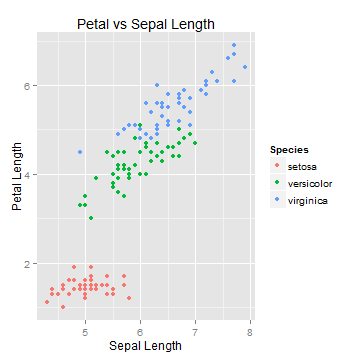 


----

## K-Nearest Neighbors
# The Algorithm
<space>

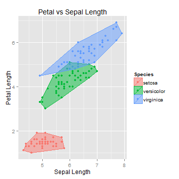 


----

## K-Nearest Neighbors
# The Algorithm
<space>


- Suppose we had a new point with Sepal Length of 7 and Petal Length of 4
- Which species will it probably belong to?

----

## K-Nearest Neighbors
# The Algorithm
<space>

- Calculate its nearest neighbor
  - Euclidean distance
  - $dist(p,q) = \sqrt{(p_1-q_1)^2+(p_2-q_2)^2+ ... + (p_n-q_n)^2}$
  - Closest neighbor -> 1-NN
  - 3 closest neighbors -> 3-NN
- Winner is the majority class of all neighbors

----

## K-Nearest Neighbors
# The Algorithm
<space>

- Calculate its nearest neighbor
  - Euclidean distance
  - $dist(p,q) = \sqrt{(p_1-q_1)^2+(p_2-q_2)^2+ ... + (p_n-q_n)^2}$
  - Closest neighbor -> 1-NN
  - 3 closest neighbors -> 3-NN
- Winner is the majority class of all neighbors
- Why not just fit to all data points?

----

## K-Nearest Neighbors
# Bias vs. Variance
<space>

- Fitting to every point results in an overfit model
  - High variance problem
- Fitting to only 1 point results in an underfit model
  - High bias problem
- Choosing the right $k$ is a balance between bias and variance
- Rule of thumb: $k = \sqrt{N}$

----

## K-Nearest Neighbors
# Data Preparation
<space>

- Classify houses based on prices and square footage


```r
library(scales)  # format ggplot() axis
price <- seq(3e+05, 6e+05, by = 10000)
size <- price/1000 + rnorm(length(price), 10, 50)
houses <- data.frame(price, size)
ex <- ggplot(houses, aes(price, size)) + geom_point() + scale_x_continuous(labels = comma) + 
    xlab("Price") + ylab("Size") + ggtitle("Square footage vs Price")
```


----

## K-Nearest Neighbors
# Data Preparation
<space>

 


----

## K-Nearest Neighbors
# Data Preparation
<space>

 


----

## K-Nearest Neighbors
# Data Preparation
<space>

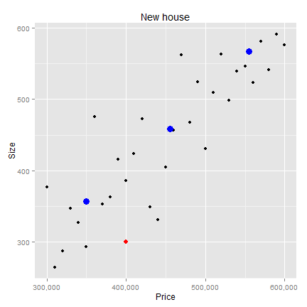 


----

## K-Nearest Neighbors
# Data Preparation
<space>

- $dist(p,q) = \sqrt{(p_1-q_1)^2+(p_2-q_2)^2+ ... + (p_n-q_n)^2}$
- Minimize the distance


```r
# 1) using loops
loop_dist <- 0
for (i in 1:nrow(houses)) {
    loop_dist[i] <- sqrt(sum((new_p - houses[i, ])^2))
}

# 2) vectorized
vec_dist <- sqrt(rowSums(t(new_p - t(houses))^2))
closest <- data.frame(houses[which.min(vec_dist), ])

print(closest)
```

```
   price  size
11 4e+05 385.9
```


----

## K-Nearest Neighbors
# Data Preparation
<space>

 


----

## K-Nearest Neighbors
# Data Preparation
<space>

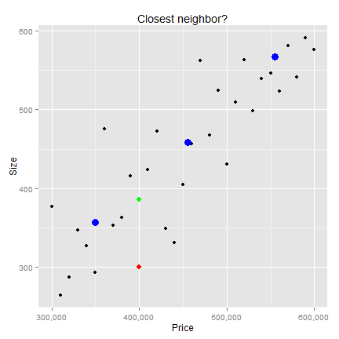 


----

## K-Nearest Neighbors
# Data Preparation
<space>

- Feature scaling. Level the playing field.
- Two common approaches:
  - min-max normalization
  - $X_{new} = \frac{X-min(X)}{max(X) - min(X)}$
  - z-score standardization
  - $X_{new} = \frac{X-mean(X)}{sd(X)}$
- Euclidean distance doesn't discriminate between important and noisy features
  - can add weights

----

## K-Nearest Neighbors
# Data Preparation
<space>


```r
new_house <- scale(houses)

# z-score standardization
new_new <- c((new_p[1] - mean(houses[, 1]))/sd(houses[, 1]), (new_p[2] - mean(houses[, 
    2]))/sd(houses[, 2]))

vec_dist <- sqrt(rowSums(t(new_new - t(new_house))^2))
scale_closest <- data.frame(houses[which.min(vec_dist), ])
```


----

## K-Nearest Neighbors
# Data Preparation
<space>

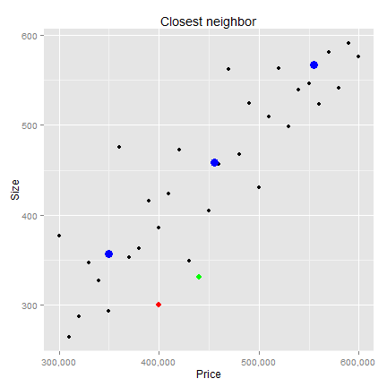 


----

## K-Nearest Neighbors
# Case study
<space>


```r
data <- read.table("http://archive.ics.uci.edu/ml/machine-learning-databases/breast-cancer-wisconsin/wdbc.data", 
    sep = ",", stringsAsFactors = FALSE, header = FALSE)

# first column has the ID which is not useful
data <- data[, -1]

# names taken from the .names file online
n <- c("radius", "texture", "perimeter", "area", "smoothness", "compactness", 
    "concavity", "concave_points", "symmetry", "fractal")
ind <- c("mean", "std", "worst")

headers <- as.character()
for (i in ind) {
    headers <- c(headers, paste(n, i))
}
names(data) <- c("diagnosis", headers)
```


----

## K-Nearest Neighbors
# Case study
<space>


```r
str(data[, 1:10])
```

```
'data.frame':	569 obs. of  10 variables:
 $ diagnosis          : chr  "M" "M" "M" "M" ...
 $ radius mean        : num  18 20.6 19.7 11.4 20.3 ...
 $ texture mean       : num  10.4 17.8 21.2 20.4 14.3 ...
 $ perimeter mean     : num  122.8 132.9 130 77.6 135.1 ...
 $ area mean          : num  1001 1326 1203 386 1297 ...
 $ smoothness mean    : num  0.1184 0.0847 0.1096 0.1425 0.1003 ...
 $ compactness mean   : num  0.2776 0.0786 0.1599 0.2839 0.1328 ...
 $ concavity mean     : num  0.3001 0.0869 0.1974 0.2414 0.198 ...
 $ concave_points mean: num  0.1471 0.0702 0.1279 0.1052 0.1043 ...
 $ symmetry mean      : num  0.242 0.181 0.207 0.26 0.181 ...
```


----

## K-Nearest Neighbors
# Case study
<space>


```r
prop.table(table(data$diagnosis))  # Balanced data set?
```

```

     B      M 
0.6274 0.3726 
```

```r
head(data)[2:6]  # inspect features more closely
```

```
  radius mean texture mean perimeter mean area mean smoothness mean
1       17.99        10.38         122.80    1001.0         0.11840
2       20.57        17.77         132.90    1326.0         0.08474
3       19.69        21.25         130.00    1203.0         0.10960
4       11.42        20.38          77.58     386.1         0.14250
5       20.29        14.34         135.10    1297.0         0.10030
6       12.45        15.70          82.57     477.1         0.12780
```


----

## K-Nearest Neighbors
# Case study
<space>


```r
# scale each numeric value
scaled_data <- as.data.frame(lapply(data[, -1], scale))
scaled_data <- cbind(diagnosis = data$diagnosis, scaled_data)
head(scaled_data[2:6])
```

```
  radius.mean texture.mean perimeter.mean area.mean smoothness.mean
1      1.0961      -2.0715         1.2688    0.9835          1.5671
2      1.8282      -0.3533         1.6845    1.9070         -0.8262
3      1.5785       0.4558         1.5651    1.5575          0.9414
4     -0.7682       0.2535        -0.5922   -0.7638          3.2807
5      1.7488      -1.1508         1.7750    1.8246          0.2801
6     -0.4760      -0.8346        -0.3868   -0.5052          2.2355
```


----

## K-Nearest Neighbors
# Case study
<space>


```r
library(class)  # get k-NN classifier
predict_1 <- knn(train = scaled_data[, 2:31], test = scaled_data[, 2:31], cl = scaled_data[, 
    1], k = floor(sqrt(nrow(scaled_data))))
prop.table(table(predict_1))
```

```
predict_1
     B      M 
0.6643 0.3357 
```


----

## K-Nearest Neighbors
# Case study
<space>


```r
pred_B <- which(predict_1 == "B")
actual_B <- which(scaled_data[, 1] == "B")
pred_M <- which(predict_1 == "M")
actual_M <- which(scaled_data[, 1] == "M")

true_positive <- sum(pred_B %in% actual_B)
true_negative <- sum(pred_M %in% actual_M)
false_positive <- sum(pred_B %in% actual_M)
false_negative <- sum(pred_M %in% actual_B)

conf_mat <- matrix(c(true_positive, false_positive, false_negative, true_negative), 
    nrow = 2, ncol = 2)

acc <- sum(diag(conf_mat))/sum(conf_mat)
tpr <- conf_mat[1, 1]/sum(conf_mat[1, ])
tn <- conf_mat[2, 2]/sum(conf_mat[2, ])
```


----

## K-Nearest Neighbors
# Case study
<space>


```
   acc    tpr     tn 
0.9596 0.9972 0.8962 
```

```
       Actual B Actual M
Pred B      356        1
Pred M       22      190
```


- Is that right?

----

## K-Nearest Neighbors
# Case study
<space>


```r
# create randomized training and testing sets
total_n <- nrow(scaled_data)

# train on 2/3 of the data
train_ind <- sample(total_n, total_n * 2/3)

train_labels <- scaled_data[train_ind, 1]
test_labels <- scaled_data[-train_ind, 1]

train_set <- scaled_data[train_ind, 2:31]
test_set <- scaled_data[-train_ind, 2:31]
```


----

## K-Nearest Neighbors
# Case study
<space>


```r
predict_1 <- knn(train = train_set, test = test_set, cl = train_labels, k = floor(sqrt(nrow(train_set))))
prop.table(table(predict_1))
```

```
predict_1
  B   M 
0.7 0.3 
```


----

## K-Nearest Neighbors
# Case study
<space>


```
   acc    tpr     tn 
0.9474 0.9323 0.9825 
```

```
       Actual B Actual M
Pred B      124        9
Pred M        1       56
```


----

## K-Nearest Neighbors
# Case study
<space>


```r
library(caret)  # Classification and Regression Training
con_mat <- confusionMatrix(predict_1, test_labels)
con_mat$table
```

```
          Reference
Prediction   B   M
         B 124   9
         M   1  56
```


----

## K-Nearest Neighbors
# Case study
<space>


```r
library(caret)  # Classification and Regression Training
con_mat <- confusionMatrix(predict_1, test_labels)
con_mat$table
```

```
          Reference
Prediction   B   M
         B 124   9
         M   1  56
```


```
Exercise:
1) Find the Accuracy for various values of k. What's the best value of k for your model?
```

----

## K-Nearest Neighbors
# Case study
<space>


```r
k_params <- c(1, 3, 5, 10, 15, 20, 25, 30, 40)
perf_acc <- NULL
per <- NULL
for (i in k_params) {
    predictions <- knn(train = train_set, test = test_set, cl = train_labels, 
        k = i)
    conf <- confusionMatrix(predictions, test_labels)$table
    perf_acc <- sum(diag(conf))/sum(conf)
    per <- rbind(per, c(i, perf_acc, conf[[1]], conf[[3]], conf[[2]], conf[[4]]))
}
```


----

## K-Nearest Neighbors
# Case study
<space>

<!-- html table generated in R 3.0.3 by xtable 1.7-3 package -->
<!-- Tue Jul 08 16:53:35 2014 -->
<TABLE border=1>
<TR> <TH> K </TH> <TH> Acc </TH> <TH> TP </TH> <TH> FP </TH> <TH> FN </TH> <TH> TN </TH>  </TR>
  <TR> <TD align="right"> 1.00 </TD> <TD align="right"> 0.95 </TD> <TD align="right"> 123.00 </TD> <TD align="right"> 7.00 </TD> <TD align="right"> 2.00 </TD> <TD align="right"> 58.00 </TD> </TR>
  <TR> <TD align="right"> 3.00 </TD> <TD align="right"> 0.97 </TD> <TD align="right"> 125.00 </TD> <TD align="right"> 5.00 </TD> <TD align="right"> 0.00 </TD> <TD align="right"> 60.00 </TD> </TR>
  <TR> <TD align="right"> 5.00 </TD> <TD align="right"> 0.95 </TD> <TD align="right"> 123.00 </TD> <TD align="right"> 7.00 </TD> <TD align="right"> 2.00 </TD> <TD align="right"> 58.00 </TD> </TR>
  <TR> <TD align="right"> 10.00 </TD> <TD align="right"> 0.96 </TD> <TD align="right"> 124.00 </TD> <TD align="right"> 7.00 </TD> <TD align="right"> 1.00 </TD> <TD align="right"> 58.00 </TD> </TR>
  <TR> <TD align="right"> 15.00 </TD> <TD align="right"> 0.95 </TD> <TD align="right"> 124.00 </TD> <TD align="right"> 9.00 </TD> <TD align="right"> 1.00 </TD> <TD align="right"> 56.00 </TD> </TR>
  <TR> <TD align="right"> 20.00 </TD> <TD align="right"> 0.95 </TD> <TD align="right"> 124.00 </TD> <TD align="right"> 9.00 </TD> <TD align="right"> 1.00 </TD> <TD align="right"> 56.00 </TD> </TR>
  <TR> <TD align="right"> 25.00 </TD> <TD align="right"> 0.95 </TD> <TD align="right"> 125.00 </TD> <TD align="right"> 9.00 </TD> <TD align="right"> 0.00 </TD> <TD align="right"> 56.00 </TD> </TR>
  <TR> <TD align="right"> 30.00 </TD> <TD align="right"> 0.95 </TD> <TD align="right"> 124.00 </TD> <TD align="right"> 9.00 </TD> <TD align="right"> 1.00 </TD> <TD align="right"> 56.00 </TD> </TR>
  <TR> <TD align="right"> 40.00 </TD> <TD align="right"> 0.94 </TD> <TD align="right"> 124.00 </TD> <TD align="right"> 11.00 </TD> <TD align="right"> 1.00 </TD> <TD align="right"> 54.00 </TD> </TR>
   </TABLE>


----

## K-Nearest Neighbors
# Summary
<space>
  
1. kNN is a lazy learning algorithm
  - Stores training data and applies it verbatim to new data
  - "instance-based" learning
2. Assigns the majority class of the k data points closest to the new data
  - Ensure all features are on the same scale
3. Strengths
  - Can be applied to data from any distribution
  - Simple and intuitive
4. Weaknesses
  - Choosing k requires trial and error
  - Testing step is computationally expensive (unlike parametric models)
  - Needs a large number of training samples to be useful

----

## Naive Bayes
# Probabilistic learning 
<space>

- Probability and Bayes Theorem
- Understanding Naive Bayes
- Case study: filtering mobile phone spam

----

## Naive Bayes
# Probability and Bayes Theorem
<space>

- Terminology: 
  + `probability`
  + `event` 
  + `trial` - e.g. 1 flip of a coin, 1 toss of a die
- $X_{i}$ is an event
- The set of all events is $\{X_{1},X_{2},...,X_{n}\}$
- The probability of an event is the frequency of its occurrence
  + $0 \leq P(X) \leq 1$
  + $P(\sum_{i=1}^{n} X_{i}) = \sum_{i=1}^{n} P(X_{i})$   (for mutually excluse $X_{i}$)

----

## Naive Bayes
# Probability and Bayes Theorem
<space>

- "A and B" is $A \cap B$ (intersect)
- Independent events
  - $P(A \cap B) = P(A) \times P(B)$
<space>
- "A given B" is $A \mid B$
- Conditional probability
  - $P(A \mid B) = \frac{P(A \cap B)}{P(B)}$

----

## Naive Bayes
# Probability and Bayes Theorem
<space>

- "A and B" is $A \cap B$ (intersect)
- Independent events
  - $P(A \cap B) = P(A) \times P(B)$
<space>
- "A given B" is $A \mid B$
- Conditional probability
  - $P(A \mid B) = \frac{P(A \cap B)}{P(B)}$ 
  - $P(B \mid A) = \frac{P(B \cap A)}{P(A)}$

----

## Naive Bayes
# Probability and Bayes Theorem
<space>

- "A and B" is $A \cap B$ (intersect)
- Independent events
  - $P(A \cap B) = P(A) \times P(B)$
<space>
- "A given B" is $A \mid B$
- Conditional probability
  - $P(A \mid B) = \frac{P(A \cap B)}{P(B)}$
  - $P(B \mid A) = \frac{P(B \cap A)}{P(A)}$
  - $P(B \mid A) \times P(A) = P(B \cap A)$

----

## Naive Bayes
# Probability and Bayes Theorem
<space>

- "A and B" is $A \cap B$ (intersect)
- Independent events
  - $P(A \cap B) = P(A) \times P(B)$
<space>
- "A given B" is $A \mid B$
- Conditional probability
  - $P(A \mid B) = \frac{P(A \cap B)}{P(B)}$
  - $P(B \mid A) = \frac{P(B \cap A)}{P(A)}$
  - $P(B \mid A) \times P(A) = P(B \cap A)$
  + but $P(B \cap A) = P(A \cap B)$

----

## Naive Bayes
# Probability and Bayes Theorem
<space>

- "A and B" is $A \cap B$ (intersect)
- Independent events
  - $P(A \cap B) = P(A) \times P(B)$
<space>
- "A given B" is $A \mid B$
- Conditional probability
  - $P(A \mid B) = \frac{P(A \cap B)}{P(B)}$
  - $P(B \mid A) = \frac{P(B \cap A)}{P(A)}$
  - $P(B \mid A) \times P(A) = P(B \cap A)$
  + but $P(B \cap A) = P(A \cap B)$
  + so $P(A \mid B) = \frac{P(B \mid A) \times P(A)}{P(B)}$

----

## Naive Bayes
# Probability and Bayes Theorem
<space>

- "A and B" is $A \cap B$ (intersect)
- Independent events
  - $P(A \cap B) = P(A) \times P(B)$
<space>
- "A given B" is $A \mid B$
- Conditional probability
  - $P(A \mid B) = \frac{P(A \cap B)}{P(B)}$
  - $P(B \mid A) = \frac{P(B \cap A)}{P(A)}$
  - $P(B \mid A) \times P(A) = P(B \cap A)$
  + but $P(B \cap A) = P(A \cap B)$
  + so $P(A \mid B) = \frac{P(B \mid A) \times P(A)}{P(B)}$ &nbsp;&nbsp;<-  &nbsp; Bayes theorem

----

## Naive Bayes
# Bayes Example
<space>

- A decision should be made using all available information
  - As new information enters, the decision might be changed
- Example: Email filtering
  - spam and non-spam (AKA ham)
  - classify emails depending on what words they contain
  - spam emails are more likely to contain certain words
  - $P(spam \mid CASH!)$

----

## Naive Bayes
# Bayes Example
<space>


```r
# data frame with frequency of emails with the word 'cash'
bayes_ex <- data.frame(cash_yes = c(10, 3, 13), cash_no = c(20, 67, 87), total = c(30, 
    70, 100), row.names = c("spam", "ham", "total"))
bayes_ex
```

```
      cash_yes cash_no total
spam        10      20    30
ham          3      67    70
total       13      87   100
```


----

## Naive Bayes
# Bayes Example
<space>

- Recall Bayes Theorem: 
  - $P(A \mid B) = \frac{P(B \mid A) \times P(A)}{P(B)}$
- A = event that email is spam  
- B = event that "CASH" exists in the email  
<space>
$P(spam \mid cash=yes) = P(cash=yes \mid spam) \times \frac{P(spam)}{P(cash=yes)}$

----

## Naive Bayes
# Bayes Example
<space>

- Recall Bayes Theorem: 
  - $P(A \mid B) = \frac{P(B \mid A) \times P(A)}{P(B)}$
- A = event that email is spam  
- B = event that "CASH" exists in the email  
$P(spam \mid cash=yes) = P(cash=yes \mid spam) \times \frac{P(spam)}{P(cash=yes)}$<br>
$P(cash = yes \mid spam) = \frac{10}{30}$<br>
$P(spam) =  \frac{30}{100}$<br>
$P(cash = yes) = \frac{13}{100}$<br>
 = $\frac{10}{30} \times \frac{\frac{30}{100}}{\frac{13}{100}} = 0.769$ 

----

## Naive Bayes
# Bayes Example
<space>

- Recall Bayes Theorem: 
  - $P(A \mid B) = \frac{P(B \mid A) \times P(A)}{P(B)}$
- A = event that email is spam  
- B = event that "CASH" exists in the email  
$P(spam \mid cash=yes) = P(cash=yes \mid spam) \times \frac{P(spam)}{P(cash=yes)}$<br>
$P(cash = yes \mid spam) = \frac{10}{30}$<br>
$P(spam) =  \frac{30}{100}$<br>
$P(cash = yes) = \frac{13}{100}$<br>
 = $\frac{10}{30} \times \frac{\frac{30}{100}}{\frac{13}{100}} = 0.769$ 

```
Exercise:
1) What is the probability of a ham email given that the word CASH! does not exist?
```

----

## Naive Bayes
# Why Naive?
<space>


```
      cash_yes cash_no furniture_yes furniture_no total
spam        10      20             6           24    30
ham          3      67            20           50    70
total       13      87            26           74   100
```


$P(spam \mid cash=yes \cap furniture=no) = \frac{P(cash=yes \cap furniture=no \mid spam) \times P(spam)}{P(cash=yes \cap furniture=no)}$

----

## Naive Bayes
# Why Naive?
<space>


```
      cash_yes cash_no furniture_yes furniture_no total
spam        10      20             6           24    30
ham          3      67            20           50    70
total       13      87            26           74   100
```


$P(spam \mid cash=yes \cap furniture=no) = \frac{P(cash=yes \cap furniture=no \mid spam) \times P(spam)}{P(cash=yes \cap furniture=no)}$

- Need $cash=yes \cap furniture=no$
  - $cash=yes \cap furniture=yes$
  - $cash=no \cap furniture=no$
  - $cash=no \cap furniture=yes$

----

## Naive Bayes
# Why Naive?
<space>

- As features increase, formula becomes very expensive
- Solution: assume each feature is independent of any other feature, given they are in the same class 
  - Independence formula: $P(A \cap B) = P(A) \times P(B)$
  - Called "class conditional independence"

----

## Naive Bayes
# Why Naive?
<space>

- As features increase, formula becomes very expensive
- Solution: assume each feature is independent of any other feature, given they are in the same class 
  - Independence formula: $P(A \cap B) = P(A) \times P(B)$
  - Called "class conditional independence":<br>
<br>
$P(spam \mid cash=yes \cap furniture=no) =$<br>
<br>

----

## Naive Bayes
# Why Naive?
<space>

- As features increase, formula becomes very expensive
- Solution: assume each feature is independent of any other feature, given they are in the same class 
  - Independence formula: $P(A \cap B) = P(A) \times P(B)$
  - Called "class conditional independence":<br>
<br>
$P(spam \mid cash=yes \cap furniture=no) =$<br>
<br>
$\frac{P(cash=yes \cap furniture=no \mid spam) \times P(spam)}{P(cash=yes \cap furniture=no)} =$<br> 
<br>

----

## Naive Bayes
# Why Naive?
<space>

- As features increase, formula becomes very expensive
- Solution: assume each feature is independent of any other feature, given they are in the same class 
  - Independence formula: $P(A \cap B) = P(A) \times P(B)$
  - Called "class conditional independence":<br>
<br>
$P(spam \mid cash=yes \cap furniture=no) =$<br>
<br>
$\frac{P(cash=yes \cap furniture=no \mid spam) \times P(spam)}{P(cash=yes \cap furniture=no)} =$<br> 
<br>
$\frac{P(cash=yes \mid spam) \times P(furniture=no \mid spam) \times P(spam)}{P(cash=yes) \times P(furniture=no)} =$<br>
<br>

----

## Naive Bayes
# Why Naive?
<space>

- As features increase, formula becomes very expensive
- Solution: assume each feature is independent of any other feature, given they are in the same class 
  - Independence formula: $P(A \cap B) = P(A) \times P(B)$
  - Called "class conditional independence":<br>
<br>
$P(spam \mid cash=yes \cap furniture=no) =$<br>
<br>
$\frac{P(cash=yes \cap furniture=no \mid spam) \times P(spam)}{P(cash=yes \cap furniture=no)} =$<br> 
<br>
$\frac{P(cash=yes \mid spam) \times P(furniture=no \mid spam) \times P(spam)}{P(cash=yes) \times P(furniture=no)} =$<br>
<br>
$\frac{\frac{10}{30} \times \frac{24}{30} \times \frac{30}{100}}{\frac{13}{100} \times \frac{74}{100}}$<br>
<br>

----

## Naive Bayes
# Why Naive?
<space>

- As features increase, formula becomes very expensive
- Solution: assume each feature is independent of any other feature, given they are in the same class 
  - Independence formula: $P(A \cap B) = P(A) \times P(B)$
  - Called "class conditional independence":<br>
<br>
$P(spam \mid cash=yes \cap furniture=no) =$<br>
<br>
$\frac{P(cash=yes \cap furniture=no \mid spam) \times P(spam)}{P(cash=yes \cap furniture=no)} =$<br> 
<br>
$\frac{P(cash=yes \mid spam) \times P(furniture=no \mid spam) \times P(spam)}{P(cash=yes) \times P(furniture=no)} =$<br>
<br>
$\frac{\frac{10}{30} \times \frac{24}{30} \times \frac{30}{100}}{\frac{13}{100} \times \frac{74}{100}}$<br>
<br>

```
Exercise:
1) What is the probability of a ham email given that the word CASH! exists and the word furniture does not?
```

----

## Naive Bayes
# The Laplace Estimator
<space>


```
      cash_yes cash_no furniture_yes furniture_no party_yes party_no total
spam        10      20             6           24         3       27    30
ham          3      67            20           50         0       70    70
total       13      87            26           74         3       97   100
```

<br>
<br>
$P(ham \mid cash=yes \cap party=yes) = \frac{P(cash=yes \mid ham) \times P(party=yes \mid ham) \times P(ham)}{P(cash=yes) \times P(party=yes)} = ?$

----

## Naive Bayes
# The Laplace Estimator
<space>


```
      cash_yes cash_no furniture_yes furniture_no party_yes party_no total
spam        10      20             6           24         3       27    30
ham          3      67            20           50         0       70    70
total       13      87            26           74         3       97   100
```

<br>
<br>
$P(ham \mid cash=yes \cap party=yes) = \frac{P(cash=yes \mid ham) \times P(party=yes \mid ham) \times P(ham)}{P(cash=yes) \times P(party=yes)} = \frac{\frac{3}{70} \times \frac{0}{70} \times \frac{70}{100}}{\frac{13}{100} \times \frac{3}{100}} = 0$

----

## Naive Bayes
# The Laplace Estimator
<space>


```
      cash_yes cash_no furniture_yes furniture_no party_yes party_no total
spam        10      20             6           24         3       27    30
ham          3      67            20           50         0       70    70
total       13      87            26           74         3       97   100
```

<br>
<br>
$P(ham \mid cash=yes \cap party=yes) = \frac{P(cash=yes \mid ham) \times P(party=yes \mid ham) \times P(ham)}{P(cash=yes) \times P(party=yes)} = \frac{\frac{3}{70} \times \frac{0}{70} \times \frac{70}{100}}{\frac{13}{100} \times \frac{3}{100}} = 0$

- To get around 0's, apply Laplace estimator
  - add 1 to every feature

----

## Naive Bayes
# Case Study: SMS spam filtering
<space>


```r
sms_data <- read.table("SMSSpamCollection.txt", stringsAsFactors = FALSE, sep = "\t", 
    quote = "", col.names = c("type", "text"))
str(sms_data)
```

```
'data.frame':	5574 obs. of  2 variables:
 $ type: chr  "ham" "ham" "spam" "ham" ...
 $ text: chr  "Go until jurong point, crazy.. Available only in bugis n great world la e buffet... Cine there got amore wat..." "Ok lar... Joking wif u oni..." "Free entry in 2 a wkly comp to win FA Cup final tkts 21st May 2005. Text FA to 87121 to receive entry question(std txt rate)T&C"| __truncated__ "U dun say so early hor... U c already then say..." ...
```

```r
sms_data$type <- factor(sms_data$type)
```


----

## Naive Bayes
# Case Study: SMS spam filtering
<space>


```r
library(tm)
# create collection of text documents, a corpus
sms_corpus <- Corpus(VectorSource(sms_data$text))
sms_corpus
```

```
A corpus with 5574 text documents
```


----

## Naive Bayes
# Case Study: SMS spam filtering
<space>


```r
# look at first few text messages
for (i in 1:5) {
    print(sms_corpus[[i]])
}
```

```
Go until jurong point, crazy.. Available only in bugis n great world la e buffet... Cine there got amore wat...
Ok lar... Joking wif u oni...
Free entry in 2 a wkly comp to win FA Cup final tkts 21st May 2005. Text FA to 87121 to receive entry question(std txt rate)T&C's apply 08452810075over18's
U dun say so early hor... U c already then say...
Nah I don't think he goes to usf, he lives around here though
```


----

## Naive Bayes
# Case Study: SMS spam filtering
<space>


```r
# clean the data using helpful functions
corpus_clean <- tm_map(sms_corpus, tolower)
corpus_clean <- tm_map(corpus_clean, removeWords, stopwords())
corpus_clean <- tm_map(corpus_clean, removePunctuation)
corpus_clean <- tm_map(corpus_clean, stripWhitespace)

# make each word in the corpus into it's own token each row is a message and
# each column is a word. Cells are frequency counts.
sms_dtm <- DocumentTermMatrix(corpus_clean)
```


----

## Naive Bayes
# Case Study: SMS spam filtering
<space>


```r
# create training and testing set
total_n <- nrow(sms_data)
train_ind <- sample(total_n, total_n * 2/3)

dtm_train_set <- sms_dtm[train_ind, ]
dtm_test_set <- sms_dtm[-train_ind, ]
corpus_train_set <- corpus_clean[train_ind]
corpus_test_set <- corpus_clean[-train_ind]
raw_train_set <- sms_data[train_ind, 1:2]
raw_test_set <- sms_data[-train_ind, 1:2]

# remove infrequent terms - not useful for classification
freq_terms <- c(findFreqTerms(dtm_train_set, 7))
corpus_train_set <- DocumentTermMatrix(corpus_train_set, list(dictionary = freq_terms))
corpus_test_set <- DocumentTermMatrix(corpus_test_set, list(dictionary = freq_terms))
```


----

## Naive Bayes
# Case Study: SMS spam filtering
<space>


```r
# convert frequency counts to 'yes' or 'no' implicitly weighing each term
# the same
convert <- function(x) {
    x <- ifelse(x > 0, 1, 0)
    x <- factor(x, levels = c(0, 1), labels = c("No", "Yes"))
    return(x)
}

corpus_train_set <- apply(corpus_train_set, MARGIN = 2, FUN = convert)
corpus_test_set <- apply(corpus_test_set, MARGIN = 2, FUN = convert)
```


----

## Naive Bayes
# Case Study: SMS spam filtering
<space>


```r
library(e1071)

naive_model <- naiveBayes(x = corpus_train_set, y = raw_train_set$type)
predict_naive <- predict(naive_model, corpus_test_set)

naive_conf <- confusionMatrix(predict_naive, raw_test_set$type)$table
naive_conf
```

```
          Reference
Prediction  ham spam
      ham  1597   23
      spam    7  231
```


----

## Naive Bayes
# Case Study: SMS spam filtering
<space>


```r
library(e1071)

naive_model <- naiveBayes(x = corpus_train_set, y = raw_train_set$type)
predict_naive <- predict(naive_model, corpus_test_set)

naive_conf <- confusionMatrix(predict_naive, raw_test_set$type)$table
naive_conf
```

```
          Reference
Prediction  ham spam
      ham  1597   23
      spam    7  231
```


```
Exercise:
1) Calculate the true positive and false positive rate.  
2) Calculate the error rate (hint: error rate = 1 - accuracy)  
3) Set the Laplace = 1 and rerun the model and confustion matrix. Does this improve the model?
```

----

## Naive Bayes
# Summary
<space>

1. Probabalistic approach
2. Naive Bayes assumes features are independent, conditioned on being in the same class
3. Useful for text classification
4. Strengths
  - Simple, fast
  - Does well with noisy and missing data
  - Doesn't need large training set
5. Weaknesses
  - Assumes all features are independent and equally important
  - Not well suited for numeric data sets


----

## Model Performance
# Measuring performance
<space>

- Classification
- Regression (more on this later)

----

## Model Performance
# Classification problems
<space>

- Accuracy is not enough
  - e.g. drug testing
  - class imbalance
- Best performance measure: Is classifier successful at intend purpose?

----

## Model Performance
# Classification problems
<space>

- 3 types of data used for measuring performance
  - actual values
  - predicted value
  - probability of prediction, i.e. confidence in prediction
- most R packages have a `predict()` function 
- confidence in predicted value matters
  - all else equal, choose the model that is more confident in its predictions
  - more confident + accuracy = better generalizer
  - set a paramter in `predict()` to `probability`, `prob`, `raw`, ...

----

## Model Performance
# Classification problems
<space>


```r
# estimate a probability for each class
confidence <- predict(naive_model, corpus_test_set, type = "raw")
as.data.frame(format(head(confidence), digits = 2, scientific = FALSE))
```

```
              ham            spam
1 0.9999980224859 0.0000019775141
2 0.9999758617729 0.0000241382271
3 0.0000000000091 0.9999999999909
4 0.9944709959147 0.0055290040853
5 0.9998858546288 0.0001141453712
6 0.9999638652818 0.0000361347182
```


----

## Model Performance
# Classification problems
<space>


```r
# estimate a probability for each class
spam_conf <- confidence[, 2]
comparison <- data.frame(predict = predict_naive, actual = raw_test_set[, 1], 
    prob_spam = spam_conf)
comparison[, 3] <- format(comparison[, 3], digits = 2, scientific = FALSE)
head(comparison)
```

```
  predict actual          prob_spam
1     ham    ham 0.0000019775140932
2     ham    ham 0.0000241382270614
3    spam   spam 0.9999999999908598
4     ham    ham 0.0055290040853312
5     ham    ham 0.0001141453711585
6     ham    ham 0.0000361347182039
```


----

## Model Performance
# Classification problems
<space>


```r
head(comparison[with(comparison, predict == actual), ])
```

```
  predict actual          prob_spam
1     ham    ham 0.0000019775140932
2     ham    ham 0.0000241382270614
3    spam   spam 0.9999999999908598
4     ham    ham 0.0055290040853312
5     ham    ham 0.0001141453711585
6     ham    ham 0.0000361347182039
```

```r
mean(as.numeric(comparison[with(comparison, predict == "spam"), ]$prob_spam))
```

```
[1] 0.9723
```


----

## Model Performance
# Classification problems
<space>


```r
head(comparison[with(comparison, predict != actual), ])
```

```
    predict actual          prob_spam
20     spam    ham 0.5757090697677075
125    spam    ham 0.5417553641799085
206     ham   spam 0.0008557227673755
231     ham   spam 0.0454769513801028
294     ham   spam 0.0488146924315075
397     ham   spam 0.0119352110379246
```

```r
mean(as.numeric(comparison[with(comparison, predict != "spam"), ]$prob_spam))
```

```
[1] 0.00552
```


----

## Model Performance
# Confusion Matrix
<space>

- Categorize predictions on whether they match actual values or not
  - Can be more than two classes
- Count the number of predictions falling on and off the diagonals


```r
table(comparison$predict, comparison$actual)
```

```
      
        ham spam
  ham  1597   23
  spam    7  231
```


----

## Model Performance
# Confusion Matrix
<space>

- True Positive (TP)
- False Positive (FP)
- True Negative (TN)
- False Negative (FN)
- $Accuracy = \frac{TN + TP}{TN + TP + FN + FP}$
- $Error = 1 - Accuracy$

----

## Model Performance
# Kappa
<space>

- Adjusts the accuracy by the probability of getting a correct prediction by chance
- $k = \frac{P(A) - P(E)}{1 - P(E)}$
  - Poor < 0.2
  - Fair < 0.4
  - Moderate < 0.6
  - Good < 0.8
  - Excellent > 0.8

----

## Model Performance
# Kappa
<space>

- $P(A)$ is the accuracy
- $P(E)$ is the proportion of results where actual = predicted
  - $P(E) = P(E = class\hspace{2 mm}1 ) + P(E = class\hspace{2 mm}2)$
  - $P(E = class 1) = P(actual = class\hspace{2 mm}1 \cap predicted = class\hspace{2 mm}1)$
    - actual and predicted are independent so...

----

## Model Performance
# Kappa
<space>

- $P(A)$ is the accuracy
- $P(E)$ is the proportion of results where actual = predicted
  - $P(E) = P(E = class\hspace{2 mm}1 ) + P(E = class\hspace{2 mm}2)$
  - $P(E = class 1) = P(actual = class\hspace{2 mm}1 \cap predicted = class\hspace{2 mm}1)$
    - actual and predicted are independent so...
  - $P(E = class 1) = P(actual = class\hspace{2 mm}1 ) \times P(predicted = class\hspace{2 mm}1)$    
    - putting it all together... 

----

## Model Performance
# Kappa
<space>

- $P(A)$ is the accuracy
- $P(E)$ is the proportion of results where actual = predicted
  - $P(E) = P(E = class\hspace{2 mm}1 ) + P(E = class\hspace{2 mm}2)$
  - $P(E = class 1) = P(actual = class\hspace{2 mm}1 \cap predicted = class\hspace{2 mm}1)$
    - actual and predicted are independent so...
  - $P(E = class 1) = P(actual = class\hspace{2 mm}1 ) \times P(predicted = class\hspace{2 mm}1)$    
    - putting it all together...
  - $P(E) = P(actual = class 1) \times P(predicted = class 1) + P(actual = class 2) \times P(predicted = class 2)$

----

## Model Performance
# Kappa
<space>

- P(A) is the accuracy
- P(E) is the proportion of results where actual = predicted
  - $P(E) = P(E = class\hspace{2 mm}1 ) + P(E = class\hspace{2 mm}2)$
  - $P(E = class 1) = P(actual = class\hspace{2 mm}1 \cap predicted = class\hspace{2 mm}1)$
    - actual and predicted are independent so...
  - $P(E = class 1) = P(actual = class\hspace{2 mm}1 ) \times P(predicted = class\hspace{2 mm}1)$    
    - putting it all together...
  - $P(E) = P(actual = class\hspace{2 mm}1) \times P(predicted = class\hspace{2 mm}1) + P(actual = class\hspace{2 mm}2) \times P(predicted = class\hspace{2 mm}2)$
  
```
Exercise: 
1) Calculate the kappa statistic for the naive classifier.
```

----

## Model Performance
# Specificity and Sensitivity
<space>

- Sensitivity: proportion of positive examples that were correctly classified (True Positive Rate)
  - $sensitivity = \frac{TP}{TP + FN}$
- Specificity: proportion of negative examples correctly classified (True Negative Rate)
  - $specificity = \frac{TN}{FP + TN}$
- Balance aggressiveness and conservativeness
- Found in the confusion matrix
- Values range from 0 to 1

----

## Model Performance
# Precision and Recall
<space>

- Originally used in information retrieval
- Precision: proportion of positives that are truly positive
  - $precision = \frac{TP}{TP + FP}$
  - Precise model only predicts positive when it is sure. Very trustworthy model.
- Recall: proportion of true positives out of all positives
  - $recall = \frac{TP}{TP + FN}$
  - High recall model will capture a large proportion of positives. Returns relevant results
- Easy to have high recall (cast a wide net) or high precision (low hanging fruit) but hard to have both high

----

## Model Performance
# Precision and Recall
<space>

- Originally used in information retrieval
- Precision: proportion of positives that are truly positive
  - $precision = \frac{TP}{TP + FP}$
  - Precise model only predicts positive when it is sure. Very trustworthy model.
- Recall: proportion of true positives out of all positives
  - $recall = \frac{TP}{TP + FN}$
  - High recall model will capture a large proportion of positives. Returns relevant results
- Easy to have high recall (cast a wide net) or high precision (low hanging fruit) but hard to have both high

```
Exercise: 
1) Find the specificity, sensitivity, precision and recall for the Naive classifier.
```

----

## Model Performance
# F-score
<space>

- Also called the F1-score, combines both precision and recall into 1 measure
- $F_{1} = 2 \times \frac{precision \times recall}{precision + recall}$
- Assumes equal weight to precision and recall

----

## Model Performance
# F-score
<space>

- Also called the F1-score, combines both precision and recall into 1 measure
- $F_{1} = 2 \times \frac{precision \times recall}{precision + recall}$
- Assumes equal weight to precision and recall

```
Exercise: 
1) Calculate the F-score for the Naive classifier.
```

----

## Model Performance
# Visualizing performance: ROC
<space>

- ROC curves measure how well your classifier can discriminate between the positive and negative class
- As threshold increases, tradeoff between TPR (sensitivity) and FPR (1 - specificity)


```r
library(ROCR)

# create a prediction function
pred <- prediction(predictions = as.numeric(comparison$predict), labels = raw_test_set[, 
    1])

# create a performance function
perf <- performance(pred, measure = "tpr", x.measure = "fpr")
```


----

## Model Performance
# Visualizing performance: ROC
<space>

- ROC curves measure how well your classifier can discriminate between the positive and negative class
- As threshold increases, tradeoff between TPR (sensitivity) and FPR (1 - specificity)

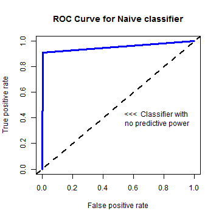 


----

## Model Performance
# Visualizing performance: ROC
<space>

- The area under the ROC curve is the AUC
- Ranges from 0.5 (no predictive power) to 1.0 (perfect classifier)
    - 0.9 – 1.0 = outstanding
    - 0.8 – 0.9 = excellent 
    - 0.7 – 0.8 = acceptable
    - 0.6 – 0.7 = poor
    - 0.5 – 0.6 = no discrimination

----

## Model Performance
# Visualizing performance: ROC
<space>


```r
auc <- performance(pred, measure = "auc")
auc@y.values
```

```
[[1]]
[1] 0.9525
```


----

## Model Performance
# Holdout method
<space>

- In the kNN `Exercise`, we cheated...kind of

----

## Model Performance
# Holdout method
<space>

- In the kNN `Exercise`, we cheated...kind of
  - Train model - 50% of data
  - Tune parameters on cross validation set - 25% of data
      - (optionally) retrain final model on training and validation set to enhance model robustness
  - Test final model - 25% of data


```r
new_data <- createDataPartition(sms_data$type, p = 0.1, list = FALSE)  # from caret package
table(sms_data[new_data, 1])
```

```

 ham spam 
 483   75 
```


----

## Model Performance
# Holdout method
<space>

- k-fold Cross Validation
   - Divide data into k random, equal sized partitions (k=10 is a commonly used)
   - Train the classifier on the K-1 parts
   - Test it on the Kth partition
   - Repeat for every K
   - Average the performance across all models - this is the Cross Validation Error
   - All examples eventually used for training and testing
   - Variance is reduced as k increases
   

```r
folds <- createFolds(sms_data$type, k = 10)  # from caret package
str(folds)
```

```
List of 10
 $ Fold01: int [1:558] 16 38 45 60 64 74 82 84 89 90 ...
 $ Fold02: int [1:557] 5 11 12 14 19 34 49 65 72 88 ...
 $ Fold03: int [1:558] 6 15 18 27 41 47 70 86 96 97 ...
 $ Fold04: int [1:557] 17 20 24 30 39 42 54 55 79 94 ...
 $ Fold05: int [1:557] 2 7 9 44 48 56 63 66 92 101 ...
 $ Fold06: int [1:558] 1 10 22 23 32 33 35 62 67 81 ...
 $ Fold07: int [1:558] 4 25 46 50 58 85 91 99 115 127 ...
 $ Fold08: int [1:556] 8 13 21 28 31 36 37 53 61 83 ...
 $ Fold09: int [1:558] 26 51 52 59 69 71 75 78 126 139 ...
 $ Fold10: int [1:557] 3 29 40 43 57 68 73 76 77 80 ...
```


----

## Model Performance
# Summary
<space>

1. Confusion Matrix measures
2. ROC and AUC
3. Holdout method

----

## Regression
# Understanding Regression
<space>

- Predicting continuous value
- Concerned about relationship between independent and dependent variables
- Can be linear, non-linear, use decision trees, etc...
- Linear and non-linear regressions are called Generalized Minear Models

----

## Regression
# Linear regression
<space>

- $Y = \hat{\alpha} + \hat{\beta} X$
- $\hat{\alpha}$ and $\hat{\beta}$ are just estimates

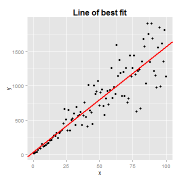 


----

## Regression
# Linear regression
<space>

- Distance between the line and each point is the error, or residual term
- Line of best fit: $Y = \alpha + \beta X + \epsilon$. &nbsp;&nbsp;&nbsp;Assumes:
  - $\epsilon$ ~ $N(0, \sigma^{2})$
  - Each point is IID (independent and identically distributed)
  - $\alpha$ is the intercept
  - $\beta$ is the coefficient
  - $X$ is the parameter
  - Both $\beta$ and $X$ are usually matrices

----

## Regression
# Linear regression
<space>

- Minimize $\epsilon$ by minimizing the mean squared error:
  - $MSE = \frac{1}{n} \sum_{i=1}^{n}\epsilon_{i}^{2} = \frac{1}{n} \sum_{i=1}^{n}(\hat{y_{i}} - y_{i})^{2}$
  - $y_{i}$ is the true/observed value
  - $\hat{y_{i}}$ is the approximation to/prediction of the true $y_{i}$
- Minimization of MSE yields an unbiased estimator with the least variance (this is good!)
- 2 common ways to minimize MSE:
  - analytical, closed form solution (e.g. `lm()` function does this)
  - approximation (e.g. gradient descent)

----

## Regression
# Gradient descent
<space>

- In Machine Learning, regression equation is called the hypothesis function
  - Linear hypothesis function: $h_{\theta}(x) = \theta_{0} + \theta_{1}x$
  - $\theta$ is $\{\beta_{0}, \beta{1}\}$, where $\beta_{0}$ is $\alpha$ from before

----

## Regression
# Gradient descent
<space>

- In Machine Learning, regression equation is called the hypothesis function
  - Linear hypothesis function: $h_{\theta}(x) = \theta_{0} + \theta_{1}x$
  - $\theta$ is $\{\beta_{0}, \beta{1}\}$, where $\beta_{0}$ is $\alpha$ from before
  - $X = \{x_{0}, x_{1}\}$
  - Make $x_{0}$ = 1
  - $h_{\theta}(x) = \beta \times t(X)$

----

## Regression
# Gradient descent
<space>

- Goal remains the same: minimize MSE
  - define a cost (aka objective) function, $J(\theta_{0},\theta_{1})$
  - $J(\theta_{0},\theta_{1}) = \frac{1}{2m}\sum_{i=1}^{m}(h_{\theta}(x_{i}) - y_{i})^2$
  - $m$ is the number of examples

----

## Regression
# Gradient descent
<space>

- Goal remains the same: minimize MSE
  - define a cost (aka objective) function, $J(\theta_{0},\theta_{1})$
  - $J(\theta_{0},\theta_{1}) = \frac{1}{2m}\sum_{i=1}^{m}(h_{\theta}(x_{i}) - y_{i})^2$
  - $m$ is the number of examples
- Find a value for $\theta$ that minimizes $J$

----

## Regression
# Gradient descent - intuition
<space>

- Given a starting value, take a step along the slope
- Continue taking a step until minimum is reached

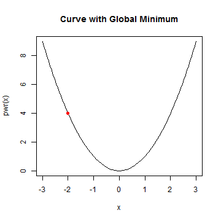 


----

## Regression
# Gradient descent - intuition
<space>

- Given a starting value, take a step along the slope
- Continue taking a step until minimum is reached

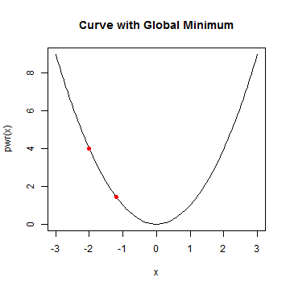 


----

## Regression
# Gradient descent - intuition
<space>

- Given a starting value, take a step along the slope
- Continue taking a step until minimum is reached

 


----

## Regression
# Gradient descent - intuition
<space>

- Given a starting value, take a step along the slope
- Continue taking a step until minimum is reached

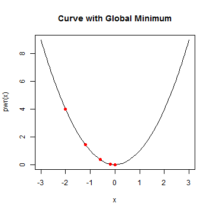 


----

## Regression
# Gradient descent - intuition
<space>

- Start with a point (guess)
- Repeat
  - Determine a descent direction 
  - Choose a step size
  - Update
- Until minimum is reached (or stopping criteria)

----

## Regression
# Gradient descent - intuition
<space>

- Start with a point (guess) &nbsp;&nbsp; &nbsp;  $x$
- Repeat
  - Determine a descent direction &nbsp;&nbsp;&nbsp;  $-f^\prime$
  - Choose a step size &nbsp;&nbsp;&nbsp;  $\alpha$ (not the intercept!)
  - Update  &nbsp;&nbsp; &nbsp; $x:=x - \alpha f^\prime$
- Until minimum is reached (or stopping criteria) &nbsp;&nbsp; &nbsp; $f^\prime \sim 0$

----

## Regression
# Gradient descent
<space>

- Update the value of $\theta$ by subtracting the first derivative of the cost function
- $\theta_{j}$ := $\theta_{j} - \alpha \frac{\partial}{\partial \theta_{j}}J(\theta_{0},\theta_{1})$
  - $j = 1, ..., p$ &nbsp;&nbsp; is the number of coefficients, or features
  - $\alpha$ is the step
  - $\frac{\partial}{\partial \theta_{j}}J(\theta_{0},\theta_{1})$ is the gradient
- Repeat until $J(\theta)$ is minimized

----

## Regression
# Gradient descent
<space>

- Using some calculus, we can show that
<br>
- $\frac{\partial}{\partial \theta_{j}}J(\theta_{0},\theta_{1})$
$=\frac{1}{2m}\sum_{i=1}^{m}(h_{\theta}(x^{i}) - y^{i})(x^{i}_{j})$

----

## Regression
# Gradient descent
<space>

- And gradient descent formula becomes:
<br>
- $\theta_{j}$ := $\theta_{j} - \alpha\frac{1}{2m}\sum_{i=1}^{m}(h_{\theta}(x^{i}) - y^{i})(x_{j}^{i})^{2}$
<br>
- Repeat until the cost function is minimized

----

## Regression
# Gradient descent
<space>

- Things to note
  - Choose the learning rate, alpha
  - Choose the stopping point
  - Local vs. global minimum
<space>
- Let's see it in action

----

## Regression example
# Gradient descent
<space>

 


----

## Regression example
# Gradient descent
<space>


```r
x <- seq(0, 1, by = 0.01)
y <- 4 + 3 * x * rnorm(length(x), 2, sd = 0.3)
df <- data.frame(cbind(X = x, Y = y))

grad_cost <- function(X, y, theta) return(sum(((X %*% theta) - y)^2))  # recall the linear hypothesis function
```


----

## Regression example
# Gradient descent
<space>


```r
gradDescent <- function(X, y, theta, iterations, alpha) {
    m <- length(y)
    grad <- rep(0, length(theta))
    cost.df <- data.frame(cost = 0, theta = 0)
    
    for (i in 1:iterations) {
        h <- X %*% theta  # hypothesis function
        grad <- (t(X) %*% (h - y))/m
        theta <- theta - alpha * grad  # Update theta by step size
        cost.df <- rbind(cost.df, c(grad_cost(X, y, theta), theta))
    }
    
    return(list(theta, cost.df))
}
```


----

## Regression example
# Gradient descent
<space>


```r
## initialize X, y and theta
X1 <- matrix(ncol = 1, nrow = nrow(df), cbind(1, df$X))
Y1 <- matrix(ncol = 1, nrow = nrow(df), df$Y)

init_theta <- as.matrix(0)
grad_cost(X1, Y1, init_theta)  # initial cost
```

```
[1] 5217
```

```r
iterations <- 1000
alpha <- 0.1
results <- gradDescent(X1, Y1, init_theta, iterations, alpha)
```


----

## Regression example
# Gradient descent
<space>

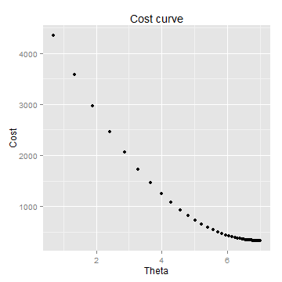 


----

## Regression example
# Gradient descent
<space>


```r
grad_cost(X1, Y1, theta[[1]])
```

```
[1] 316
```

```r
## Make some predictions
intercept <- df[df$X == 0, ]$Y
pred <- function(x) return(intercept + x %*% theta)
new_points <- c(0.1, 0.5, 0.8, 1.1)
new_preds <- data.frame(X = new_points, Y = sapply(new_points, pred))
```


----

## Regression example
# Gradient descent
<space>


```r
ggplot(data = df, aes(x = X, y = Y)) + geom_point(size = 2)
```

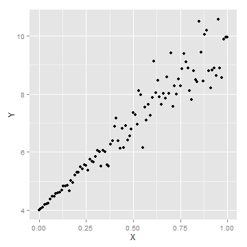 


----

## Regression example
# Gradient descent
<space>


```r
ggplot(data = df, aes(x = X, y = Y)) + geom_point() + geom_point(data = new_preds, 
    aes(x = X, y = Y, color = "red"), size = 3.5) + scale_colour_discrete(guide = FALSE)
```

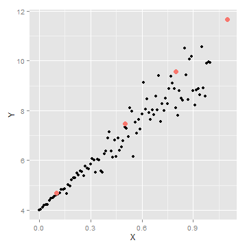 


----

## Regression
# Gradient descent - Summary
<space>

1. Minimization algorithm
2. Approximation, non-closed form solution
3. Good for large number of examples
4. Hard to select the right $\alpha$ and starting point
5. Finds local not global minimum
6. Optimization algorithms are used in practice

----

## Regression
# CV Error
<space>

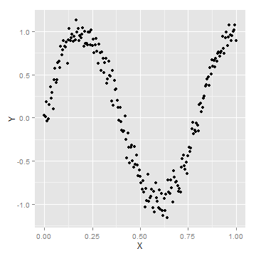 


----

## Regression
# CV Error
<space>

 


- Simple linear model won't fit

----

## Regression
# CV Error
<space>

- Let's add some features


```r
df <- transform(df, X2 = X^2, X3 = X^3)
fit_3 <- lm(Y ~ ., df)
summary(fit_3)$adj.r.squared
```

```
[1] 0.8195
```

```r
sqrt(mean((predict(fit_3) - df$Y)^2))  # Root MSE
```

```
[1] 0.2936
```


----

## Regression
# CV Error
<space>

- Let's add even more features


```r
df <- transform(df, X4 = X^4, X5 = X^5, X6 = X^6, X7 = X^7, X8 = X^8, X9 = X^9, 
    X10 = X^10, X11 = X^11, X12 = X^12, X13 = X^13, X14 = X^14, X15 = X^15, 
    X16 = X^16, X17 = X^17, X18 = X^18, X19 = X^19, X20 = X^20)
line.fit <- lm(Y ~ ., df)
summary(line.fit)$adj.r.squared
```

```
[1] 0.9786
```

```r
sqrt(mean((predict(line.fit) - df$Y)^2))  # Root MSE
```

```
[1] 0.09781
```


----

## Regression
# CV Error
<space>

- Use orthogonal polynomials to avoid correlated features
- `poly()` function


```r
ortho.coefs <- with(df, cor(poly(X, degree = 3)))
sum(ortho.coefs[upper.tri(ortho.coefs)])  # polynomials are uncorrelated
```

```
[1] -4.807e-17
```

```r
linear.fit <- lm(Y ~ poly(X, degree = 20), df)
summary(linear.fit)$adj.r.squared
```

```
[1] 0.9781
```

```r
sqrt(mean((predict(linear.fit) - df$Y)^2))
```

```
[1] 0.09766
```


----

## Regression
# CV Error
<space>

- When to stop adding othogonal features?

 


----

## Regression
# CV Error
<space>

- Use cross-validation to determine best degree


```r
x <- seq(0, 1, by = 0.005)
y <- sin(3 * pi * x) + rnorm(length(x), 0, 0.1)

indices <- sort(sample(length(x), round(0.5 * length(x))))

training.x <- x[indices]
training.y <- y[indices]

test.x <- x[-indices]
test.y <- y[-indices]

training.df <- data.frame(X = training.x, Y = training.y)
test.df <- data.frame(X = test.x, Y = test.y)

rmse <- function(y, h) return(sqrt(mean((y - h)^2)))
```


----

## Regression
# CV Error
<space>


```r
performance <- data.frame()
degrees <- 1:20
for (d in degrees) {
    fits <- lm(Y ~ poly(X, degree = d), data = training.df)
    performance <- rbind(performance, data.frame(Degree = d, Data = "Training", 
        RMSE = rmse(training.y, predict(fits))))
    performance <- rbind(performance, data.frame(Degree = d, Data = "Test", 
        RMSE = rmse(test.y, predict(fits, newdata = test.df))))
}
```


----

## Regression
# CV Error
<space>

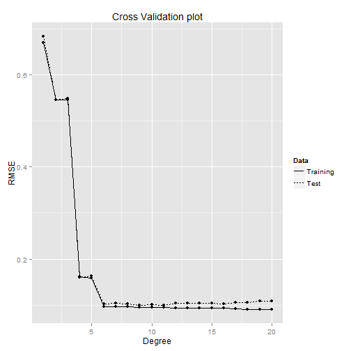 


----

## Regression
# Summary
<space>

1. Minimize MSE of target function
2. Analytical vs. approximation
3. Approximation is preferrable when lots of examples
4. Use Cross Validation plot to determine optimal number of parameters

----

## Summary
<space>
<space>

1. Machine learning overview and concepts
2. Visualizing Data
3. kNN algorithm
4. Naive Bayes
5. Model performance measures
6. Regression

----

## Next Time?
<space> 
<space>

- Logistic regression
- Decision Trees
- Clustering
- Dimensionality reduction
- Regularization

----

## Resources
<space>
<space>

- [Presentation](http://github.com/ilanman/Rpres_ML)
- [Machine Learning with R](http://www.packtpub.com/machine-learning-with-r/book)
- [Machine Learning for Hackers](http://shop.oreilly.com/product/0636920018483.do)
- [Elements of Statistical Learning](http://web.stanford.edu/~hastie/local.ftp/Springer/OLD/ESLII_print4.pdf)
- [Machine Learning for Astronomy - Scikit Learn](http://www.astroml.org/sklearn_tutorial/)

----

## THANKS!

----
